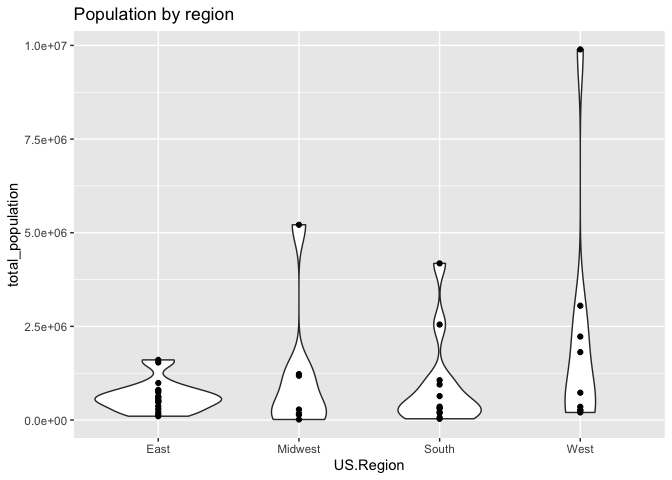
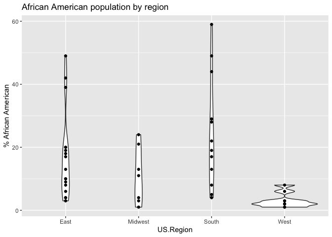
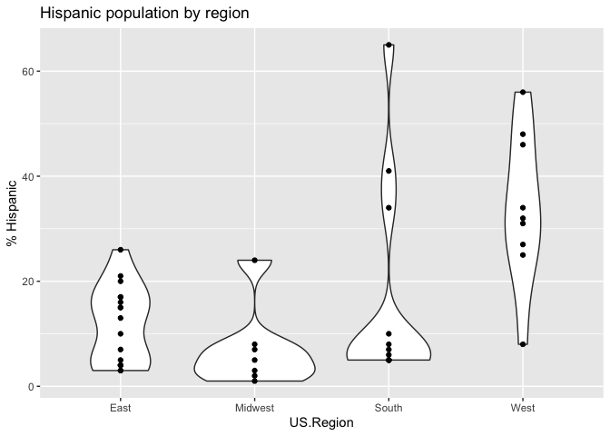
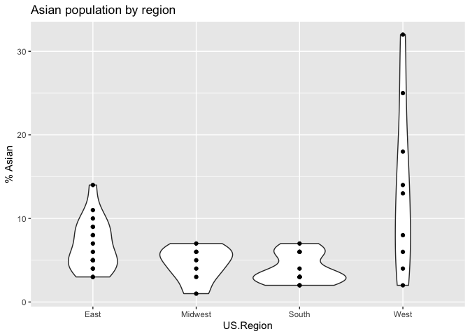
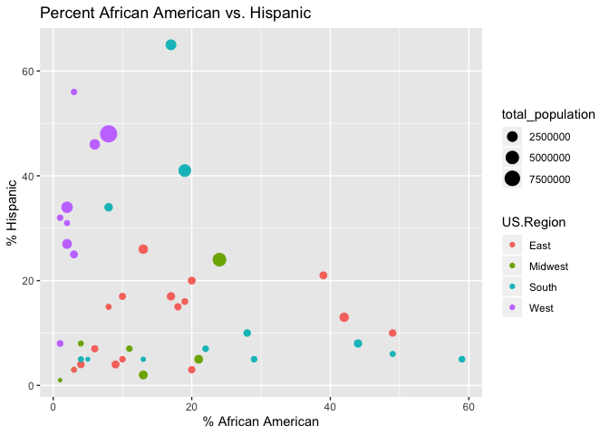
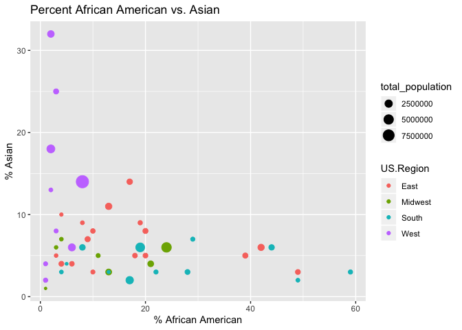
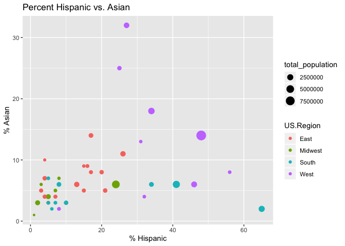
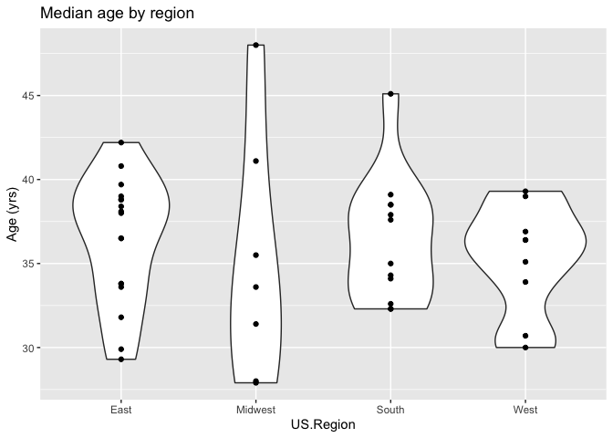
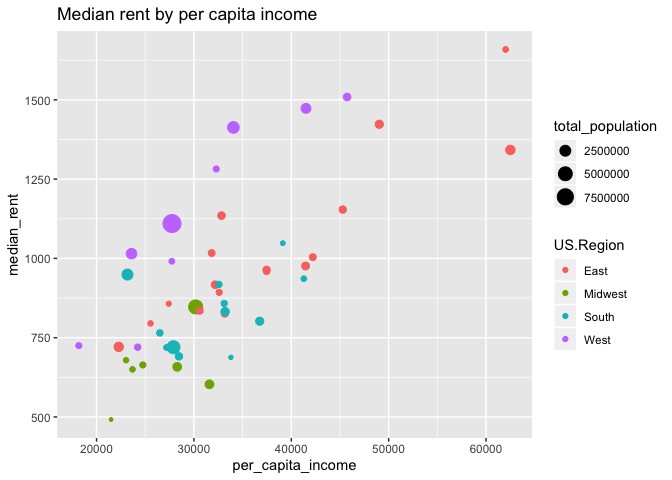

Data collection site demographics
================
Rick O. Gilmore
2019-11-07 11:01:19

## Background

This report provides preliminary analysis of the demographic
characteristics of the sites under consideration to collect data for the
PLAY project. This report focuses on data at the county level. It uses
the
[`choroplethr`](https://cran.r-project.org/web/packages/choroplethr/index.html)
package.

## Generate data file(s)

Load county names, and add county FIPS from `choroplethr` package’s
`county.regions` dataset. With this, I can extract demographic data
using the `get_county_demographics()`
function.

``` r
counties <- read.csv(paste0(csv.dir, "city-state-county.csv"), stringsAsFactors = FALSE)

# Load county data from choroplethr
# Could also use acs package to get updated info.
data("county.regions")

counties <- left_join(counties, county.regions)

demo <- choroplethr::get_county_demographics(endyear=2013, span=5)

county.demo <- left_join(counties, demo)

# Recapitalize county
county.demo$County <- unlist(lapply(county.demo$County, Cap.all))
```

## Race/ethnicity

Summaries of county-by-county race/ethnicity data.

``` r
# Select collecting sites only
county.demo %>%
  filter(Collecting == "Collecting") ->
  county.demo

county.demo %>%
  arrange(US.Region, Site.code, State, City, County) %>%
  select(US.Region, Site.code, City, State, County, total_population, percent_white,
         percent_black, percent_asian, percent_hispanic) %>%
  knitr::kable()
```

| US.Region | Site.code | City            | State | County               | total\_population | percent\_white | percent\_black | percent\_asian | percent\_hispanic |
| :-------- | :-------- | :-------------- | :---- | :------------------- | ----------------: | -------------: | -------------: | -------------: | ----------------: |
| East      | BU        | Boston          | MA    | Suffolk              |            735701 |             48 |             20 |              8 |                20 |
| East      | CHOP      | Camden          | NJ    | Camden               |            513512 |             60 |             18 |              5 |                15 |
| East      | CHOP      | Woodbury        | NJ    | Gloucester           |            289098 |             80 |             10 |              3 |                 5 |
| East      | CHOP      | Doylestown      | PA    | Bucks                |            625977 |             86 |              4 |              4 |                 4 |
| East      | CHOP      | Media           | PA    | Delaware             |            559771 |             70 |             20 |              5 |                 3 |
| East      | CHOP      | Norristown      | PA    | Montgomery           |            804621 |             78 |              9 |              7 |                 4 |
| East      | CHOP      | Philadelphia    | PA    | Philadelphia         |           1536704 |             37 |             42 |              6 |                13 |
| East      | CHOP      | West Chester    | PA    | Chester              |            503075 |             82 |              6 |              4 |                 7 |
| East      | COR       | Ithaca          | NY    | Tompkins             |            102270 |             79 |              4 |             10 |                 4 |
| East      | CUNYSI    | Staten Island   | NY    | Richmond             |            470223 |             64 |             10 |              8 |                17 |
| East      | GTN       | Washington      | DC    | District Of columbia |            619371 |             35 |             49 |              3 |                10 |
| East      | GTN       | Bethesda        | MD    | Montgomery           |            989474 |             48 |             17 |             14 |                17 |
| East      | GTN       | Arlington       | VA    | Arlington            |            214861 |             64 |              8 |              9 |                15 |
| East      | NYU       | New York        | NY    | New York             |           1605272 |             48 |             13 |             11 |                26 |
| East      | PRIN      | Princeton       | NJ    | Mercer               |            368094 |             54 |             19 |              9 |                16 |
| East      | PSU       | University Park | PA    | Centre               |            154460 |             88 |              3 |              5 |                 3 |
| East      | RUTG      | Newark          | NJ    | Essex                |            785853 |             33 |             39 |              5 |                21 |
| Midwest   | CHI       | Chicago         | IL    | Cook                 |           5212372 |             44 |             24 |              6 |                24 |
| Midwest   | IU        | Bloomington     | IN    | Monroe               |            139634 |             86 |              3 |              6 |                 3 |
| Midwest   | MSU       | East Lansing    | MI    | Clinton              |             14017 |             96 |              1 |              1 |                 1 |
| Midwest   | MSU       | East Lansing    | MI    | Ingham               |            281531 |             72 |             11 |              5 |                 7 |
| Midwest   | OSU       | Columbus        | OH    | Franklin             |           1181824 |             67 |             21 |              4 |                 5 |
| Midwest   | PITT      | Pittsburgh      | PA    | Allegheny            |           1226933 |             80 |             13 |              3 |                 2 |
| Midwest   | PUR       | W. Lafayette    | IN    | Tippecanoe           |            175628 |             80 |              4 |              7 |                 8 |
| South     | HOU       | Houston         | TX    | Harris               |           4182285 |             33 |             19 |              6 |                41 |
| South     | TUL       | New Orleans     | LA    | Orleans              |            357013 |             31 |             59 |              3 |                 5 |
| South     | UGA       | Athens          | GA    | Clarke               |            948554 |             41 |             44 |              6 |                 8 |
| South     | UGA       | Athens          | GA    | Oconee               |             33240 |             86 |              5 |              4 |                 5 |
| South     | UMIA      | Miami           | FL    | Miami-Dade           |           2549075 |             16 |             17 |              2 |                65 |
| South     | UT        | Austin          | TX    | Travis               |           1063248 |             50 |              8 |              6 |                34 |
| South     | VBLT      | Franklin        | TN    | Williamson           |            188935 |             86 |              4 |              3 |                 5 |
| South     | VBLT      | Nashville       | TN    | Davidson             |            638395 |             57 |             28 |              3 |                10 |
| South     | VCU       | Chesterfield    | VA    | Chesterfield         |            320430 |             65 |             22 |              3 |                 7 |
| South     | VCU       | Richmond        | VA    | Henrico              |            311314 |             56 |             29 |              7 |                 5 |
| South     | VCU       | Richmond        | VA    | Richmond             |            207878 |             39 |             49 |              2 |                 6 |
| South     | WM        | Williamsburg    | VA    | James City           |             68171 |             77 |             13 |              3 |                 5 |
| West      | CSF       | Fullerton       | CA    | Orange               |           3051771 |             43 |              2 |             18 |                34 |
| West      | CSL       | Long Beach      | CA    | Los Angeles          |           9893481 |             28 |              8 |             14 |                48 |
| West      | STAN      | Palo Alto       | CA    | San Mateo            |            729543 |             42 |              3 |             25 |                25 |
| West      | STAN      | Palo Alto       | CA    | Santa Clara          |           1812208 |             35 |              2 |             32 |                27 |
| West      | UCD       | Davis           | CA    | Yolo                 |            202288 |             49 |              2 |             13 |                31 |
| West      | UCM       | Merced          | CA    | Merced               |            258707 |             31 |              3 |              8 |                56 |
| West      | UCR       | Riverside       | CA    | Riverside            |           2228528 |             39 |              6 |              6 |                46 |
| West      | UCSC      | Santa Cruz      | CA    | Santa Cruz           |            264808 |             59 |              1 |              4 |                32 |
| West      | UO        | Eugene          | OR    | Lane                 |            353382 |             84 |              1 |              2 |                 8 |

### Summary across counties

``` r
county.demo %>%
  arrange(US.Region, Site.code, State, City, County) %>%
  select(US.Region, Site.code, City, State, County, total_population, percent_white,
         percent_black, percent_asian, percent_hispanic) %>%
  group_by(US.Region) %>%
  summarise(med_black = median(percent_black),
            min_black = min(percent_black),
            max_black = max(percent_black),
            med_hisp = median(percent_hispanic),
            min_hisp = min(percent_hispanic),
            max_hisp = max(percent_hispanic))%>%
  knitr::kable()
```

| US.Region | med\_black | min\_black | max\_black | med\_hisp | min\_hisp | max\_hisp |
| :-------- | ---------: | ---------: | ---------: | --------: | --------: | --------: |
| East      |       13.0 |          3 |         49 |      13.0 |         3 |        26 |
| Midwest   |       11.0 |          1 |         24 |       5.0 |         1 |        24 |
| South     |       20.5 |          4 |         59 |       6.5 |         5 |        65 |
| West      |        2.0 |          1 |          8 |      32.0 |         8 |        56 |

## Plots of population, race/ethnicity, & age by region

County-level data.

``` r
county.demo %>%
  ggplot() +
  aes(x = US.Region, y = total_population) +
  geom_violin() +
  geom_point() +
  ggtitle("Population by region")
```

<!-- -->

``` r
county.demo %>%
  ggplot() +
  aes(x = US.Region, y = percent_black) +
  geom_violin() +
  geom_point() +
  ggtitle("African American population by region") +
  ylab("% African American")
```

<!-- -->

``` r
county.demo %>%
  ggplot() +
  aes(x = US.Region, y = percent_hispanic) +
  geom_violin() +
  geom_point() +
  ggtitle("Hispanic population by region") +
  ylab("% Hispanic")
```

<!-- -->

``` r
county.demo %>%
  ggplot() +
  aes(x = US.Region, y = percent_asian) +
  geom_violin() +
  geom_point() +
  ggtitle("Asian population by region") +
  ylab("% Asian")
```

<!-- -->

``` r
county.demo %>%
  ggplot() +
  aes(x = percent_black, y = percent_hispanic, 
      color = US.Region,
      size = total_population) +
  geom_point() +
  ggtitle("Percent African American vs. Hispanic") +
  xlab("% African American") +
  ylab("% Hispanic")
```

<!-- -->

``` r
county.demo %>%
  ggplot() +
  aes(x = percent_black, y = percent_asian, 
      color = US.Region,
      size = total_population) +
  geom_point() +
  ggtitle("Percent African American vs. Asian") +
  xlab("% African American") +
  ylab("% Asian")
```

<!-- -->

``` r
county.demo %>%
  ggplot() +
  aes(x = percent_hispanic, y = percent_asian, 
      color = US.Region,
      size = total_population) +
  geom_point() +
  ggtitle("Percent Hispanic vs. Asian") +
  xlab("% Hispanic") +
  ylab("% Asian")
```

<!-- -->

``` r
county.demo %>%
  ggplot() +
  aes(x = US.Region, y = median_age) +
  geom_violin() +
  geom_point() +
  ggtitle("Median age by region") +
  ylab("Age (yrs)")
```

<!-- -->

## Economic indicators

The `county.regions` data set from the `choroplethr` package contains
data about per capita income and median rent.

We present a tabular summary first of the county-by-county data.

``` r
county.demo %>%
  arrange(US.Region, Site.code, State, City, County) %>%
  select(US.Region, Site.code, City, State, County, total_population,
         per_capita_income, median_rent) %>%
  knitr::kable()
```

| US.Region | Site.code | City            | State | County               | total\_population | per\_capita\_income | median\_rent |
| :-------- | :-------- | :-------------- | :---- | :------------------- | ----------------: | ------------------: | -----------: |
| East      | BU        | Boston          | MA    | Suffolk              |            735701 |               32835 |         1135 |
| East      | CHOP      | Camden          | NJ    | Camden               |            513512 |               30592 |          835 |
| East      | CHOP      | Woodbury        | NJ    | Gloucester           |            289098 |               32600 |          893 |
| East      | CHOP      | Doylestown      | PA    | Bucks                |            625977 |               37466 |          964 |
| East      | CHOP      | Media           | PA    | Delaware             |            559771 |               33179 |          826 |
| East      | CHOP      | Norristown      | PA    | Montgomery           |            804621 |               41472 |          976 |
| East      | CHOP      | Philadelphia    | PA    | Philadelphia         |           1536704 |               22279 |          721 |
| East      | CHOP      | West Chester    | PA    | Chester              |            503075 |               42210 |         1004 |
| East      | COR       | Ithaca          | NY    | Tompkins             |            102270 |               27418 |          857 |
| East      | CUNYSI    | Staten Island   | NY    | Richmond             |            470223 |               31823 |         1017 |
| East      | GTN       | Washington      | DC    | District Of columbia |            619371 |               45290 |         1154 |
| East      | GTN       | Bethesda        | MD    | Montgomery           |            989474 |               49038 |         1423 |
| East      | GTN       | Arlington       | VA    | Arlington            |            214861 |               62018 |         1659 |
| East      | NYU       | New York        | NY    | New York             |           1605272 |               62498 |         1342 |
| East      | PRIN      | Princeton       | NJ    | Mercer               |            368094 |               37465 |          959 |
| East      | PSU       | University Park | PA    | Centre               |            154460 |               25545 |          795 |
| East      | RUTG      | Newark          | NJ    | Essex                |            785853 |               32181 |          917 |
| Midwest   | CHI       | Chicago         | IL    | Cook                 |           5212372 |               30183 |          847 |
| Midwest   | IU        | Bloomington     | IN    | Monroe               |            139634 |               23032 |          679 |
| Midwest   | MSU       | East Lansing    | MI    | Clinton              |             14017 |               21492 |          492 |
| Midwest   | MSU       | East Lansing    | MI    | Ingham               |            281531 |               24754 |          664 |
| Midwest   | OSU       | Columbus        | OH    | Franklin             |           1181824 |               28283 |          658 |
| Midwest   | PITT      | Pittsburgh      | PA    | Allegheny            |           1226933 |               31593 |          603 |
| Midwest   | PUR       | W. Lafayette    | IN    | Tippecanoe           |            175628 |               23691 |          650 |
| South     | HOU       | Houston         | TX    | Harris               |           4182285 |               27899 |          720 |
| South     | TUL       | New Orleans     | LA    | Orleans              |            357013 |               26500 |          765 |
| South     | UGA       | Athens          | GA    | Clarke               |            948554 |               36757 |          802 |
| South     | UGA       | Athens          | GA    | Oconee               |             33240 |               33801 |          688 |
| South     | UMIA      | Miami           | FL    | Miami-Dade           |           2549075 |               23174 |          949 |
| South     | UT        | Austin          | TX    | Travis               |           1063248 |               33206 |          832 |
| South     | VBLT      | Franklin        | TN    | Williamson           |            188935 |               41292 |          936 |
| South     | VBLT      | Nashville       | TN    | Davidson             |            638395 |               28467 |          691 |
| South     | VCU       | Chesterfield    | VA    | Chesterfield         |            320430 |               32572 |          918 |
| South     | VCU       | Richmond        | VA    | Henrico              |            311314 |               33115 |          858 |
| South     | VCU       | Richmond        | VA    | Richmond             |            207878 |               27184 |          719 |
| South     | WM        | Williamsburg    | VA    | James City           |             68171 |               39133 |         1048 |
| West      | CSF       | Fullerton       | CA    | Orange               |           3051771 |               34057 |         1413 |
| West      | CSL       | Long Beach      | CA    | Los Angeles          |           9893481 |               27749 |         1110 |
| West      | STAN      | Palo Alto       | CA    | San Mateo            |            729543 |               45732 |         1509 |
| West      | STAN      | Palo Alto       | CA    | Santa Clara          |           1812208 |               41513 |         1473 |
| West      | UCD       | Davis           | CA    | Yolo                 |            202288 |               27730 |          991 |
| West      | UCM       | Merced          | CA    | Merced               |            258707 |               18177 |          725 |
| West      | UCR       | Riverside       | CA    | Riverside            |           2228528 |               23591 |         1015 |
| West      | UCSC      | Santa Cruz      | CA    | Santa Cruz           |            264808 |               32295 |         1282 |
| West      | UO        | Eugene          | OR    | Lane                 |            353382 |               24224 |          720 |

### Summary across counties

This plots the median (min & max) of the per capita income and the
median (min & max) of median rent.

``` r
county.demo %>%
  arrange(US.Region, Site.code, State, City, County) %>%
  select(US.Region, Site.code, City, State, County, total_population,
         per_capita_income, median_rent) %>%
  group_by(US.Region) %>%
  summarize(med_per_cap_inc = median(per_capita_income),
            min_per_cap_inc = min(per_capita_income),
            max_per_cap_inc = max(per_capita_income),
            med_med_rent = median(median_rent),
            min_med_rent = min(median_rent),
            max_med_rent = max(median_rent)) %>%
  knitr::kable()
```

| US.Region | med\_per\_cap\_inc | min\_per\_cap\_inc | max\_per\_cap\_inc | med\_med\_rent | min\_med\_rent | max\_med\_rent |
| :-------- | -----------------: | -----------------: | -----------------: | -------------: | -------------: | -------------: |
| East      |            33179.0 |              22279 |              62498 |            964 |            721 |           1659 |
| Midwest   |            24754.0 |              21492 |              31593 |            658 |            492 |            847 |
| South     |            32843.5 |              23174 |              41292 |            817 |            688 |           1048 |
| West      |            27749.0 |              18177 |              45732 |           1110 |            720 |           1509 |

``` r
county.demo %>%
  ggplot() +
  aes(x = per_capita_income, y = median_rent,
      color = US.Region,
      size = total_population) +
  geom_point() +
  ggtitle("Median rent by per capita income")
```

<!-- -->

## Further exploration of the ACS

The `acs` package manual can be found here:
<https://cran.r-project.org/web/packages/acs/acs.pdf>. A useful guide to
the ACS can be found here:
<https://www.census.gov/content/dam/Census/library/publications/2008/acs/ACSGeneralHandbook.pdf>.
And, an especially useful guide by the `acs` package author can be found
here:
<http://dusp.mit.edu/sites/dusp.mit.edu/files/attachments/publications/working_with_acs_R_v_2.0.pdf>

### Generate geography for sites

As a first attempt, create vectors of numeric state FIPS and county FIPS
codes.

``` r
state.fips <- as.numeric(county.demo$state.fips.character)
county.fips <- as.numeric(substr(county.demo$county.fips.character,3,5))
play.geo <- acs::geo.make(state = state.fips, county = county.fips)
```

This works, and I use it blow. I also provide the following code to
generate site-specific geographies for future use cases.

``` r
Make.county.geo <- function(i, df) {
  acs::geo.make(state = as.numeric(df$state.fips.character[i]),
              county =
             as.numeric(substr(county.demo$county.fips.character[i],4, 6)))
}

cty <- 1
# Generate name for county-level geography
geo.name <- paste0(county.demo$Site.code[cty], "_", county.demo$county.name[cty], "_", county.demo$State[cty])

# Create geography and assign to generated name
assign(geo.name, Make.county.geo(cty, county.demo))
```

## Education data from ACS

``` r
ed.attain <- acs::acs.lookup(table.name="Educational Attainment for the Population 25 Years and Over", endyear=2015)

# Variables 1:25 seem to contain the relevant info
play.ed <- acs::acs.fetch(geography = play.geo, endyear = 2015, variable = ed.attain[1:25],
                     col.names = c("Total",
                                   "None",
                                   "<K",
                                   "K",
                                   "1st",
                                   "2nd",
                                   "3rd",
                                   "4th",
                                   "5th",
                                   "6th",
                                   "7th",
                                   "8th",
                                   "9th",
                                   "10th",
                                   "11th",
                                   "12th",
                                   "HS",
                                   "GED",
                                   "Coll <1yr",
                                   "Coll >1yr",
                                   "AA",
                                   "BA",
                                   "MA",
                                   "Prof",
                                   "Ph.D"))
```

``` r
# Columns 2:16 are grades < HS diploma
lt.hs <- function(i) sum(play.ed[i,2:16])
hs.grad <- function(i) sum(play.ed[i,17:18])
some.coll <- function(i) sum(play.ed[i,19:21])
ba.plus <- function(i) sum(play.ed[i,22:25])

# Use functions to create data table for easier manipulation
Make.ed.attain.table <- function(i) {
  this.cty <- slot(play.ed[i,1], "geography")$NAME
  data.frame(county = this.cty,
             tot = as.numeric(slot(play.ed[i,1], "estimate")),
             lt.hs = as.numeric(slot(lt.hs(i), "estimate")),
             hs.grad = as.numeric(slot(hs.grad(i), "estimate")),
             some.coll = as.numeric(slot(some.coll(i), "estimate")),
             ba.plus = as.numeric(slot(ba.plus(i), "estimate")))
}

ed.attain.list <- lapply(1:dim(play.ed)[1], Make.ed.attain.table)
ed.attain.df <- Reduce( function(x,y) full_join(x,y, all=TRUE), ed.attain.list)
```

``` r
ed.attain.df %>%
  mutate(p.lt.hs = 100*lt.hs/tot,
         p.hs.grad = 100*hs.grad/tot,
         p.some.coll = 100*some.coll/tot,
         p.ba.plus = 100*ba.plus/tot) %>%
  select(county, p.lt.hs, p.hs.grad, p.some.coll, p.ba.plus) %>%
  knitr::kable()
```

| county                                     |   p.lt.hs | p.hs.grad | p.some.coll | p.ba.plus |
| :----------------------------------------- | --------: | --------: | ----------: | --------: |
| Los Angeles County, California             | 22.718630 | 20.676552 |    26.33454 |  30.27027 |
| Merced County, California                  | 32.124274 | 24.848266 |    29.94784 |  13.07962 |
| Orange County, California                  | 15.731238 | 17.689816 |    28.84002 |  37.73893 |
| Riverside County, California               | 19.913051 | 25.819297 |    33.34025 |  20.92741 |
| San Mateo County, California               | 11.672114 | 16.535181 |    26.17003 |  45.62267 |
| Santa Clara County, California             | 13.024218 | 15.167082 |    23.86490 |  47.94380 |
| Santa Cruz County, California              | 14.396614 | 15.487459 |    31.87140 |  38.24453 |
| Yolo County, California                    | 14.506227 | 19.697083 |    26.82260 |  38.97409 |
| District of Columbia, District of Columbia | 10.668529 | 17.996837 |    16.75794 |  54.57670 |
| Miami-Dade County, Florida                 | 19.910852 | 28.492734 |    24.67464 |  26.92177 |
| Fulton County, Georgia                     |  9.055800 | 18.005673 |    23.63889 |  49.29963 |
| Oconee County, Georgia                     |  6.846064 | 21.285932 |    26.98576 |  44.88224 |
| Cook County, Illinois                      | 14.709575 | 23.951799 |    25.56936 |  35.76927 |
| Monroe County, Indiana                     |  7.644555 | 22.310366 |    25.06800 |  44.97708 |
| Tippecanoe County, Indiana                 |  9.719412 | 26.604045 |    28.51591 |  35.16063 |
| Orleans Parish, Louisiana                  | 14.842995 | 23.151391 |    26.71059 |  35.29503 |
| Suffolk County, Massachusetts              | 15.708324 | 23.607559 |    19.00435 |  41.67977 |
| Montgomery County, Maryland                |  8.822279 | 13.968895 |    19.34383 |  57.86500 |
| Crawford County, Michigan                  | 12.522949 | 35.394724 |    34.93091 |  17.15142 |
| Ingham County, Michigan                    |  8.202319 | 21.622739 |    32.92508 |  37.24986 |
| Camden County, New Jersey                  | 12.074268 | 31.320041 |    26.44240 |  30.16329 |
| Essex County, New Jersey                   | 15.806027 | 28.728008 |    22.77177 |  32.69419 |
| Gloucester County, New Jersey              |  8.335119 | 34.333650 |    28.01957 |  29.31166 |
| Mercer County, New Jersey                  | 12.561574 | 25.615744 |    22.17729 |  39.64540 |
| New York County, New York                  | 13.376256 | 12.610941 |    14.08307 |  59.92973 |
| Richmond County, New York                  | 11.300797 | 31.964367 |    25.94675 |  30.78809 |
| Tompkins County, New York                  |  5.763363 | 19.816934 |    23.59287 |  50.82683 |
| Franklin County, Ohio                      | 10.004303 | 25.147930 |    27.28086 |  37.56691 |
| Lane County, Oregon                        |  8.892151 | 24.967860 |    37.74043 |  28.39956 |
| Allegheny County, Pennsylvania             |  6.458414 | 29.826715 |    25.95835 |  37.75653 |
| Bucks County, Pennsylvania                 |  6.542183 | 30.652041 |    25.38795 |  37.41782 |
| Centre County, Pennsylvania                |  6.822231 | 31.613749 |    20.17269 |  41.39133 |
| Chester County, Pennsylvania               |  7.276344 | 23.179965 |    20.40566 |  49.13803 |
| Delaware County, Pennsylvania              |  7.793264 | 31.782900 |    24.37388 |  36.04996 |
| Montgomery County, Pennsylvania            |  6.248537 | 24.813364 |    22.06307 |  46.87503 |
| Philadelphia County, Pennsylvania          | 17.981287 | 33.822359 |    22.78378 |  25.41257 |
| Davidson County, Tennessee                 | 12.716788 | 24.092843 |    25.90111 |  37.28926 |
| Williamson County, Tennessee               |  4.656689 | 16.371417 |    23.23685 |  55.73504 |
| Harris County, Texas                       | 20.412793 | 23.326487 |    26.80649 |  29.45423 |
| Travis County, Texas                       | 12.166591 | 17.104836 |    24.77124 |  45.95733 |
| Arlington County, Virginia                 |  6.522062 |  8.299942 |    12.29320 |  72.88480 |
| Chesterfield County, Virginia              |  9.037095 | 24.096152 |    29.97047 |  36.89628 |
| Henrico County, Virginia                   |  9.341698 | 22.841190 |    27.13650 |  40.68061 |
| James City County, Virginia                |  6.207560 | 21.079798 |    25.68395 |  47.02869 |
| Richmond city, Virginia                    | 16.815834 | 23.029182 |    24.10500 |  36.04999 |

Now, calculate mean proportions of attainment across counties and use to
calculate numbers out of *n*=900.

``` r
ed.attain.df %>%
  mutate(p.lt.hs = lt.hs/tot,
         p.hs.grad = hs.grad/tot,
         p.some.coll = some.coll/tot,
         p.ba.plus = ba.plus/tot) %>%
  select(county, p.lt.hs, p.hs.grad, p.some.coll, p.ba.plus) ->
  ed.attain.by.cty

ed.attain.by.cty %>%
  knitr::kable()
```

| county                                     |   p.lt.hs | p.hs.grad | p.some.coll | p.ba.plus |
| :----------------------------------------- | --------: | --------: | ----------: | --------: |
| Los Angeles County, California             | 0.2271863 | 0.2067655 |   0.2633454 | 0.3027027 |
| Merced County, California                  | 0.3212427 | 0.2484827 |   0.2994784 | 0.1307962 |
| Orange County, California                  | 0.1573124 | 0.1768982 |   0.2884002 | 0.3773893 |
| Riverside County, California               | 0.1991305 | 0.2581930 |   0.3334025 | 0.2092741 |
| San Mateo County, California               | 0.1167211 | 0.1653518 |   0.2617003 | 0.4562267 |
| Santa Clara County, California             | 0.1302422 | 0.1516708 |   0.2386490 | 0.4794380 |
| Santa Cruz County, California              | 0.1439661 | 0.1548746 |   0.3187140 | 0.3824453 |
| Yolo County, California                    | 0.1450623 | 0.1969708 |   0.2682260 | 0.3897409 |
| District of Columbia, District of Columbia | 0.1066853 | 0.1799684 |   0.1675794 | 0.5457670 |
| Miami-Dade County, Florida                 | 0.1991085 | 0.2849273 |   0.2467464 | 0.2692177 |
| Fulton County, Georgia                     | 0.0905580 | 0.1800567 |   0.2363889 | 0.4929963 |
| Oconee County, Georgia                     | 0.0684606 | 0.2128593 |   0.2698576 | 0.4488224 |
| Cook County, Illinois                      | 0.1470958 | 0.2395180 |   0.2556936 | 0.3576927 |
| Monroe County, Indiana                     | 0.0764456 | 0.2231037 |   0.2506800 | 0.4497708 |
| Tippecanoe County, Indiana                 | 0.0971941 | 0.2660405 |   0.2851591 | 0.3516063 |
| Orleans Parish, Louisiana                  | 0.1484299 | 0.2315139 |   0.2671059 | 0.3529503 |
| Suffolk County, Massachusetts              | 0.1570832 | 0.2360756 |   0.1900435 | 0.4167977 |
| Montgomery County, Maryland                | 0.0882228 | 0.1396889 |   0.1934383 | 0.5786500 |
| Crawford County, Michigan                  | 0.1252295 | 0.3539472 |   0.3493091 | 0.1715142 |
| Ingham County, Michigan                    | 0.0820232 | 0.2162274 |   0.3292508 | 0.3724986 |
| Camden County, New Jersey                  | 0.1207427 | 0.3132004 |   0.2644240 | 0.3016329 |
| Essex County, New Jersey                   | 0.1580603 | 0.2872801 |   0.2277177 | 0.3269419 |
| Gloucester County, New Jersey              | 0.0833512 | 0.3433365 |   0.2801957 | 0.2931166 |
| Mercer County, New Jersey                  | 0.1256157 | 0.2561574 |   0.2217729 | 0.3964540 |
| New York County, New York                  | 0.1337626 | 0.1261094 |   0.1408307 | 0.5992973 |
| Richmond County, New York                  | 0.1130080 | 0.3196437 |   0.2594675 | 0.3078809 |
| Tompkins County, New York                  | 0.0576336 | 0.1981693 |   0.2359287 | 0.5082683 |
| Franklin County, Ohio                      | 0.1000430 | 0.2514793 |   0.2728086 | 0.3756691 |
| Lane County, Oregon                        | 0.0889215 | 0.2496786 |   0.3774043 | 0.2839956 |
| Allegheny County, Pennsylvania             | 0.0645841 | 0.2982671 |   0.2595835 | 0.3775653 |
| Bucks County, Pennsylvania                 | 0.0654218 | 0.3065204 |   0.2538795 | 0.3741782 |
| Centre County, Pennsylvania                | 0.0682223 | 0.3161375 |   0.2017269 | 0.4139133 |
| Chester County, Pennsylvania               | 0.0727634 | 0.2317996 |   0.2040566 | 0.4913803 |
| Delaware County, Pennsylvania              | 0.0779326 | 0.3178290 |   0.2437388 | 0.3604996 |
| Montgomery County, Pennsylvania            | 0.0624854 | 0.2481336 |   0.2206307 | 0.4687503 |
| Philadelphia County, Pennsylvania          | 0.1798129 | 0.3382236 |   0.2278378 | 0.2541257 |
| Davidson County, Tennessee                 | 0.1271679 | 0.2409284 |   0.2590111 | 0.3728926 |
| Williamson County, Tennessee               | 0.0465669 | 0.1637142 |   0.2323685 | 0.5573504 |
| Harris County, Texas                       | 0.2041279 | 0.2332649 |   0.2680649 | 0.2945423 |
| Travis County, Texas                       | 0.1216659 | 0.1710484 |   0.2477124 | 0.4595733 |
| Arlington County, Virginia                 | 0.0652206 | 0.0829994 |   0.1229320 | 0.7288480 |
| Chesterfield County, Virginia              | 0.0903710 | 0.2409615 |   0.2997047 | 0.3689628 |
| Henrico County, Virginia                   | 0.0934170 | 0.2284119 |   0.2713650 | 0.4068061 |
| James City County, Virginia                | 0.0620756 | 0.2107980 |   0.2568395 | 0.4702869 |
| Richmond city, Virginia                    | 0.1681583 | 0.2302918 |   0.2410500 | 0.3604999 |

``` r
# This uses mean p's so it may result in estimates != 900
ed.attain.by.cty %>%
  summarize(study.proj.lt.hs = mean(p.lt.hs),
            study.proj.hs.grad = mean(p.hs.grad),
            study.proj.some.coll = mean(p.some.coll),
            study.proj.ba.plus = mean(p.ba.plus)) %>%
  knitr::kable()
```

| study.proj.lt.hs | study.proj.hs.grad | study.proj.some.coll | study.proj.ba.plus |
| ---------------: | -----------------: | -------------------: | -----------------: |
|        0.1195229 |          0.2339449 |            0.2534271 |          0.3931051 |

### Household income data from ACS

It looks like table `B19001` contains “HOUSEHOLD INCOME IN THE PAST 12
MONTHS (IN 2013 INFLATION-ADJUSTED DOLLARS)”, and there are 17 fields.

``` r
# Table B19001
hh.income <- acs::acs.fetch(geography = play.geo, endyear = 2015, table.number = "B19001")

# If we take $25K for family of 3-4 as poverty rate
lt.25k <- function(i) sum(hh.income[i,2:5])
lt.50k  <- function(i) sum(hh.income[i,6:10])
lt.100k    <- function(i) sum(hh.income[i,11:13])
gt.100k    <- function(i) sum(hh.income[i,14:17])

Make.hh.income.table <- function(i) {
  this.cty <- slot(hh.income[i,1], "geography")$NAME
  data.frame(county = this.cty,
             tot = as.numeric(slot(hh.income[i,1], "estimate")),
             lt.25k = as.numeric(slot(lt.25k(i), "estimate")),
             lt.50k = as.numeric(slot(lt.50k(i), "estimate")),
             lt.100k = as.numeric(slot(lt.100k(i), "estimate")),
             gt.100k = as.numeric(slot(gt.100k(i), "estimate")))
}

hh.income.list <- lapply(1:dim(hh.income)[1], Make.hh.income.table)
hh.income.df <- Reduce( function(x,y) full_join(x,y, all=TRUE), hh.income.list)

hh.income.df %>%
  mutate(p.lt.25k = lt.25k/tot,
         p.lt.50k = lt.50k/tot,
         p.lt.100k = lt.100k/tot,
         p.gt.100k = gt.100k/tot) %>%
  select(county, p.lt.25k, p.lt.50k, p.lt.100k, p.gt.100k) ->
  hh.income.by.cty

hh.income.by.cty %>%
  knitr::kable()
```

| county                                     |  p.lt.25k |  p.lt.50k | p.lt.100k | p.gt.100k |
| :----------------------------------------- | --------: | --------: | --------: | --------: |
| Los Angeles County, California             | 0.2295094 | 0.2212365 | 0.2823535 | 0.2669006 |
| Merced County, California                  | 0.2854091 | 0.2797070 | 0.2825130 | 0.1523709 |
| Orange County, California                  | 0.1520073 | 0.1788898 | 0.2896430 | 0.3794599 |
| Riverside County, California               | 0.2103322 | 0.2357801 | 0.3126459 | 0.2412418 |
| San Mateo County, California               | 0.1123249 | 0.1498512 | 0.2633235 | 0.4745005 |
| Santa Clara County, California             | 0.1257307 | 0.1437736 | 0.2459986 | 0.4844971 |
| Santa Cruz County, California              | 0.1878019 | 0.1960296 | 0.2860277 | 0.3301407 |
| Yolo County, California                    | 0.2448574 | 0.2099393 | 0.2685806 | 0.2766226 |
| District of Columbia, District of Columbia | 0.2182340 | 0.1629906 | 0.2471634 | 0.3716120 |
| Miami-Dade County, Florida                 | 0.3063849 | 0.2515018 | 0.2590741 | 0.1830392 |
| Fulton County, Georgia                     | 0.2345792 | 0.2096606 | 0.2634430 | 0.2923173 |
| Oconee County, Georgia                     | 0.1280303 | 0.2061448 | 0.3160774 | 0.3497475 |
| Cook County, Illinois                      | 0.2387544 | 0.2185270 | 0.2882351 | 0.2544835 |
| Monroe County, Indiana                     | 0.3216099 | 0.2420567 | 0.2683098 | 0.1680236 |
| Tippecanoe County, Indiana                 | 0.2828089 | 0.2520367 | 0.3001210 | 0.1650334 |
| Orleans Parish, Louisiana                  | 0.3749184 | 0.2305146 | 0.2205368 | 0.1740303 |
| Suffolk County, Massachusetts              | 0.2805860 | 0.1817158 | 0.2609279 | 0.2767703 |
| Montgomery County, Maryland                | 0.0955330 | 0.1374102 | 0.2696483 | 0.4974085 |
| Crawford County, Michigan                  | 0.2680551 | 0.3070205 | 0.3372523 | 0.0876722 |
| Ingham County, Michigan                    | 0.2844645 | 0.2535003 | 0.2815845 | 0.1804507 |
| Camden County, New Jersey                  | 0.2158774 | 0.1984675 | 0.2945067 | 0.2911484 |
| Essex County, New Jersey                   | 0.2583670 | 0.2128702 | 0.2516137 | 0.2771491 |
| Gloucester County, New Jersey              | 0.1431408 | 0.1759888 | 0.3124257 | 0.3684448 |
| Mercer County, New Jersey                  | 0.1773934 | 0.1724909 | 0.2822070 | 0.3679086 |
| New York County, New York                  | 0.2307391 | 0.1511596 | 0.2226410 | 0.3954604 |
| Richmond County, New York                  | 0.1904044 | 0.1649073 | 0.2931163 | 0.3515719 |
| Tompkins County, New York                  | 0.2581123 | 0.2231929 | 0.2835153 | 0.2351794 |
| Franklin County, Ohio                      | 0.2327060 | 0.2439837 | 0.3063296 | 0.2169807 |
| Lane County, Oregon                        | 0.2861285 | 0.2634458 | 0.2989708 | 0.1514549 |
| Allegheny County, Pennsylvania             | 0.2428173 | 0.2290523 | 0.2981338 | 0.2299966 |
| Bucks County, Pennsylvania                 | 0.1310745 | 0.1833515 | 0.3042872 | 0.3812868 |
| Centre County, Pennsylvania                | 0.2436388 | 0.2361891 | 0.2983054 | 0.2218666 |
| Chester County, Pennsylvania               | 0.1206566 | 0.1661803 | 0.2819244 | 0.4312388 |
| Delaware County, Pennsylvania              | 0.1814520 | 0.2110815 | 0.2948478 | 0.3126187 |
| Montgomery County, Pennsylvania            | 0.1348201 | 0.1714826 | 0.2975478 | 0.3961494 |
| Philadelphia County, Pennsylvania          | 0.3518183 | 0.2517064 | 0.2494054 | 0.1470700 |
| Davidson County, Tennessee                 | 0.2429611 | 0.2710069 | 0.2987991 | 0.1872329 |
| Williamson County, Tennessee               | 0.0974841 | 0.1372665 | 0.2825643 | 0.4826852 |
| Harris County, Texas                       | 0.2228348 | 0.2369886 | 0.2862807 | 0.2538959 |
| Travis County, Texas                       | 0.1930947 | 0.2203657 | 0.2989281 | 0.2876115 |
| Arlington County, Virginia                 | 0.1015735 | 0.1045804 | 0.2581546 | 0.5356914 |
| Chesterfield County, Virginia              | 0.1148403 | 0.2063324 | 0.3507967 | 0.3280307 |
| Henrico County, Virginia                   | 0.1695334 | 0.2285354 | 0.3245712 | 0.2773600 |
| James City County, Virginia                | 0.1296429 | 0.1783214 | 0.3281786 | 0.3638571 |
| Richmond city, Virginia                    | 0.3290264 | 0.2585183 | 0.2459071 | 0.1665482 |

``` r
# This uses mean p's so it may result in estimates != 900
hh.income.by.cty %>%
  summarize(study.proj.lt.25k = mean(p.lt.25k),
            study.proj.lt.50k = mean(p.lt.50k),
            study.proj.lt.100k = mean(p.lt.100k),
            study.proj.gt.100k = mean(p.gt.100k)) %>%
  knitr::kable()
```

| study.proj.lt.25k | study.proj.lt.50k | study.proj.lt.100k | study.proj.gt.100k |
| ----------------: | ----------------: | -----------------: | -----------------: |
|         0.2129349 |         0.2081278 |          0.2841648 |          0.2947725 |

### Percentage of Spanish speakers

It appears that table `B16007` contains info about `AGE BY LANGUAGE
SPOKEN AT HOME FOR THE POPULATION 5 YEARS AND OVER`.

ACSSF B16007 46 1 Total:  
ACSSF B16007 46 2 5 to 17 years:  
ACSSF B16007 46 3 Speak only English  
ACSSF B16007 46 4 Speak Spanish  
ACSSF B16007 46 5 Speak other Indo-European languages ACSSF B16007 46 6
Speak Asian and Pacific Island languages  
ACSSF B16007 46 7 Speak other languages  
ACSSF B16007 46 8 18 to 64 years: ACSSF B16007 46 9 Speak only English  
ACSSF B16007 46 10 Speak Spanish  
ACSSF B16007 46 11 Speak other Indo-European languages ACSSF B16007 46
12 Speak Asian and Pacific Island languages  
ACSSF B16007 46 13 Speak other languages  
ACSSF B16007 46 14 65 years and over:  
ACSSF B16007 46 15 Speak only English  
ACSSF B16007 46 16 Speak Spanish  
ACSSF B16007 46 17 Speak other Indo-European languages ACSSF B16007 46
18 Speak Asian and Pacific Island languages  
ACSSF B16007 46 19 Speak other languages

For our purposes, I suggest we define “English speaking” as 9 + 15;
“Spanish speaking” as 10+16, and “Other speaking” as
sum(11:13)+sum(17:19).

``` r
# Table B16007
lang.at.home <- acs::acs.fetch(geography = play.geo, endyear = 2015, table.number = "B16007")

english <- function(i) lang.at.home[i,9] + lang.at.home[i,15]
spanish  <- function(i) lang.at.home[i,10] + lang.at.home[i,16]
other <- function(i) sum(lang.at.home[i,11:13]) + sum(lang.at.home[i,17:19])
tot <- function(i) lang.at.home[i,8] + lang.at.home[i,14]

Make.lang.at.home <- function(i) {
  this.cty <- slot(lang.at.home[i,1], "geography")$NAME
  data.frame(county = this.cty,
             tot = as.numeric(slot(tot(i), "estimate")),
             english = as.numeric(slot(english(i), "estimate")),
             spanish = as.numeric(slot(spanish(i), "estimate")),
             other = as.numeric(slot(other(i), "estimate")))
}

lang.at.home.list <- lapply(1:dim(lang.at.home)[1], Make.lang.at.home)
lang.at.home.df <- Reduce( function(x,y) full_join(x,y, all=TRUE), lang.at.home.list)

lang.at.home.df %>%
  mutate(p.english = english/tot,
         p.spanish = spanish/tot,
         p.other = other/tot) %>%
  select(county, p.english, p.spanish, p.other) ->
  lang.at.home.by.cty

lang.at.home.by.cty %>%
  knitr::kable()
```

| county                                     | p.english | p.spanish |   p.other |
| :----------------------------------------- | --------: | --------: | --------: |
| Los Angeles County, California             | 0.4307724 | 0.3788118 | 0.1904158 |
| Merced County, California                  | 0.4729326 | 0.4238769 | 0.1031904 |
| Orange County, California                  | 0.5452002 | 0.2473834 | 0.2074164 |
| Riverside County, California               | 0.6015960 | 0.3200709 | 0.0783331 |
| San Mateo County, California               | 0.5313899 | 0.1882867 | 0.2803234 |
| Santa Clara County, California             | 0.4747717 | 0.1761238 | 0.3491046 |
| Santa Cruz County, California              | 0.7003775 | 0.2350389 | 0.0645836 |
| Yolo County, California                    | 0.6436704 | 0.1969819 | 0.1593477 |
| District of Columbia, District of Columbia | 0.8314164 | 0.0795891 | 0.0889945 |
| Miami-Dade County, Florida                 | 0.2628578 | 0.6495962 | 0.0875460 |
| Fulton County, Georgia                     | 0.8372743 | 0.0623211 | 0.1004046 |
| Oconee County, Georgia                     | 0.9202474 | 0.0331139 | 0.0466387 |
| Cook County, Illinois                      | 0.6560420 | 0.1914925 | 0.1524654 |
| Monroe County, Indiana                     | 0.8900974 | 0.0218534 | 0.0880493 |
| Tippecanoe County, Indiana                 | 0.8491829 | 0.0546894 | 0.0961277 |
| Orleans Parish, Louisiana                  | 0.9058712 | 0.0447047 | 0.0494240 |
| Suffolk County, Massachusetts              | 0.6220890 | 0.1737364 | 0.2041746 |
| Montgomery County, Maryland                | 0.5977085 | 0.1535492 | 0.2487423 |
| Crawford County, Michigan                  | 0.9806006 | 0.0063779 | 0.0130215 |
| Ingham County, Michigan                    | 0.8791836 | 0.0355736 | 0.0852428 |
| Camden County, New Jersey                  | 0.7988834 | 0.1152360 | 0.0858807 |
| Essex County, New Jersey                   | 0.6483052 | 0.1867735 | 0.1649213 |
| Gloucester County, New Jersey              | 0.9122925 | 0.0377216 | 0.0499859 |
| Mercer County, New Jersey                  | 0.7101846 | 0.1316414 | 0.1581740 |
| New York County, New York                  | 0.6043605 | 0.2160970 | 0.1795424 |
| Richmond County, New York                  | 0.6852955 | 0.1027182 | 0.2119863 |
| Tompkins County, New York                  | 0.8583154 | 0.0229472 | 0.1187374 |
| Franklin County, Ohio                      | 0.8780535 | 0.0335552 | 0.0883914 |
| Lane County, Oregon                        | 0.9181392 | 0.0439754 | 0.0378854 |
| Allegheny County, Pennsylvania             | 0.9266391 | 0.0135575 | 0.0598034 |
| Bucks County, Pennsylvania                 | 0.8858937 | 0.0303328 | 0.0837736 |
| Centre County, Pennsylvania                | 0.8985879 | 0.0170608 | 0.0843514 |
| Chester County, Pennsylvania               | 0.8840506 | 0.0503467 | 0.0656028 |
| Delaware County, Pennsylvania              | 0.8809701 | 0.0258173 | 0.0932126 |
| Montgomery County, Pennsylvania            | 0.8649153 | 0.0325944 | 0.1024903 |
| Philadelphia County, Pennsylvania          | 0.7787684 | 0.0971465 | 0.1240851 |
| Davidson County, Tennessee                 | 0.8514803 | 0.0754677 | 0.0730520 |
| Williamson County, Tennessee               | 0.9207445 | 0.0300279 | 0.0492276 |
| Harris County, Texas                       | 0.5754705 | 0.3284024 | 0.0961271 |
| Travis County, Texas                       | 0.6924457 | 0.2289606 | 0.0785937 |
| Arlington County, Virginia                 | 0.7135793 | 0.1320907 | 0.1543300 |
| Chesterfield County, Virginia              | 0.8899595 | 0.0566519 | 0.0533886 |
| Henrico County, Virginia                   | 0.8504706 | 0.0422600 | 0.1072694 |
| James City County, Virginia                | 0.9247889 | 0.0331971 | 0.0420140 |
| Richmond city, Virginia                    | 0.9033650 | 0.0508509 | 0.0457841 |

``` r
# This uses mean p's so it may result in estimates != 900
lang.at.home.by.cty %>%
  summarize(study.proj.english = mean(p.english),
            study.proj.spanish = mean(p.spanish),
            study.proj.other= mean(p.other)) %>%
  knitr::kable()
```

| study.proj.english | study.proj.spanish | study.proj.other |
| -----------------: | -----------------: | ---------------: |
|          0.7575387 |          0.1290801 |        0.1133813 |

### Better data about race/ethnicity

These data presume all Hispanics do not also report a race. NIH
enrollment tables have a more flexible and richer categorization.

## Work in progress

The state and county FIPS values are embedded in the S4 data structure
returned by the `acs.fetch` function. There is a `geography` slot with
`state` and `county` fields. `state` is numeric and `county` is char.

``` r
str(play.ed)
```

    ## Formal class 'acs' [package "acs"] with 9 slots
    ##   ..@ endyear       : int 2015
    ##   ..@ span          : int 5
    ##   ..@ geography     :'data.frame':   45 obs. of  3 variables:
    ##   .. ..$ NAME  : chr [1:45] "Los Angeles County, California" "Merced County, California" "Orange County, California" "Riverside County, California" ...
    ##   .. ..$ state : int [1:45] 6 6 6 6 6 6 6 6 11 12 ...
    ##   .. ..$ county: chr [1:45] "037" "047" "059" "065" ...
    ##   ..@ acs.colnames  : chr [1:25] "Total" "None" "<K" "K" ...
    ##   ..@ modified      : logi TRUE
    ##   ..@ acs.units     : Factor w/ 5 levels "count","dollars",..: NA NA NA NA NA NA NA NA NA NA ...
    ##   ..@ currency.year : int 2015
    ##   ..@ estimate      : num [1:45, 1:25] 6653174 152405 2077783 1441999 530221 ...
    ##   .. ..- attr(*, "dimnames")=List of 2
    ##   .. .. ..$ : chr [1:45] "Los Angeles County, California" "Merced County, California" "Orange County, California" "Riverside County, California" ...
    ##   .. .. ..$ : chr [1:25] "Total" "None" "<K" "K" ...
    ##   ..@ standard.error: num [1:45, 1:25] 0 90 0 0 43.2 ...
    ##   .. ..- attr(*, "dimnames")=List of 2
    ##   .. .. ..$ : chr [1:45] "Los Angeles County, California" "Merced County, California" "Orange County, California" "Riverside County, California" ...
    ##   .. .. ..$ : chr [1:25] "Total" "None" "<K" "K" ...

``` r
slot(play.ed[1,1], "geography")
```

    ##                             NAME state county
    ## 1 Los Angeles County, California     6    037

``` r
state.numeric <- slot(play.ed[1,1], "geography")$state
county.char <- slot(play.ed[1,1], "geography")$county
```

1.  I could use these to add data collection site tags to the
    county-wide data.
2.  The `Make.*.table` functions could be made more generic.

## Resources

### R Session

This document was prepared in RStudio 1.0.143. Session information
follows.

``` r
sessionInfo()
```

    ## R version 3.5.3 (2019-03-11)
    ## Platform: x86_64-apple-darwin15.6.0 (64-bit)
    ## Running under: macOS Mojave 10.14.6
    ## 
    ## Matrix products: default
    ## BLAS: /Library/Frameworks/R.framework/Versions/3.5/Resources/lib/libRblas.0.dylib
    ## LAPACK: /Library/Frameworks/R.framework/Versions/3.5/Resources/lib/libRlapack.dylib
    ## 
    ## locale:
    ## [1] en_US.UTF-8/en_US.UTF-8/en_US.UTF-8/C/en_US.UTF-8/en_US.UTF-8
    ## 
    ## attached base packages:
    ## [1] stats     graphics  grDevices utils     datasets  methods   base     
    ## 
    ## other attached packages:
    ##  [1] choroplethrMaps_1.0.1 choroplethr_3.6.3     acs_2.1.4            
    ##  [4] XML_3.98-1.20         forcats_0.4.0         stringr_1.4.0        
    ##  [7] dplyr_0.8.1           purrr_0.3.2           readr_1.3.1          
    ## [10] tidyr_0.8.3           tibble_2.1.3          tidyverse_1.2.1      
    ## [13] ggplot2_3.2.0        
    ## 
    ## loaded via a namespace (and not attached):
    ##  [1] nlme_3.1-140        bitops_1.0-6        sf_0.7-4           
    ##  [4] lubridate_1.7.4     RColorBrewer_1.1-2  httr_1.4.0         
    ##  [7] tools_3.5.3         backports_1.1.4     rgdal_1.4-4        
    ## [10] R6_2.4.0            rpart_4.1-15        KernSmooth_2.23-15 
    ## [13] Hmisc_4.2-0         DBI_1.0.0           lazyeval_0.2.2     
    ## [16] colorspace_1.4-1    nnet_7.3-12         withr_2.1.2        
    ## [19] sp_1.3-1            tidyselect_0.2.5    gridExtra_2.3      
    ## [22] curl_3.3            compiler_3.5.3      cli_1.1.0          
    ## [25] rvest_0.3.4         htmlTable_1.13.1    xml2_1.2.0         
    ## [28] labeling_0.3        scales_1.0.0        checkmate_1.9.3    
    ## [31] classInt_0.3-3      rappdirs_0.3.1      digest_0.6.19      
    ## [34] foreign_0.8-71      rmarkdown_1.13      base64enc_0.1-3    
    ## [37] jpeg_0.1-8          pkgconfig_2.0.2     htmltools_0.3.6    
    ## [40] highr_0.8           htmlwidgets_1.3     rlang_0.4.0        
    ## [43] readxl_1.3.1        rstudioapi_0.10     generics_0.0.2     
    ## [46] jsonlite_1.6        acepack_1.4.1       magrittr_1.5       
    ## [49] Formula_1.2-3       Matrix_1.2-17       Rcpp_1.0.1         
    ## [52] munsell_0.5.0       stringi_1.4.3       yaml_2.2.0         
    ## [55] RJSONIO_1.3-1.2     plyr_1.8.4          grid_3.5.3         
    ## [58] maptools_0.9-5      WDI_2.6.0           crayon_1.3.4       
    ## [61] lattice_0.20-38     haven_2.1.0         splines_3.5.3      
    ## [64] hms_0.4.2           knitr_1.23          pillar_1.4.1       
    ## [67] uuid_0.1-2          rjson_0.2.20        codetools_0.2-16   
    ## [70] glue_1.3.1          evaluate_0.14       latticeExtra_0.6-28
    ## [73] data.table_1.12.2   modelr_0.1.4        png_0.1-7          
    ## [76] RgoogleMaps_1.4.3   cellranger_1.1.0    gtable_0.3.0       
    ## [79] assertthat_0.2.1    xfun_0.8            broom_0.5.2        
    ## [82] e1071_1.7-2         class_7.3-15        survival_2.44-1.1  
    ## [85] tigris_0.8.2        units_0.6-3         cluster_2.1.0      
    ## [88] ggmap_3.0.0
