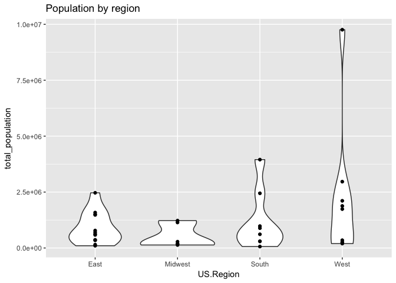
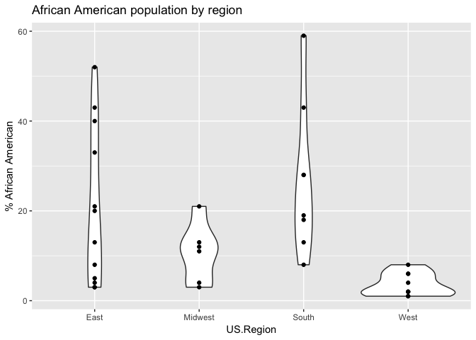
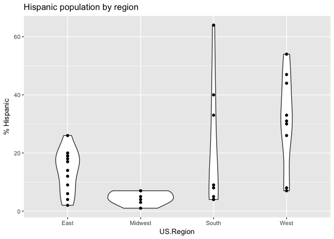
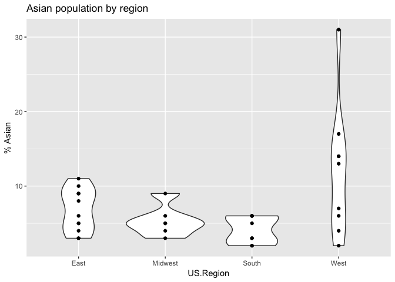
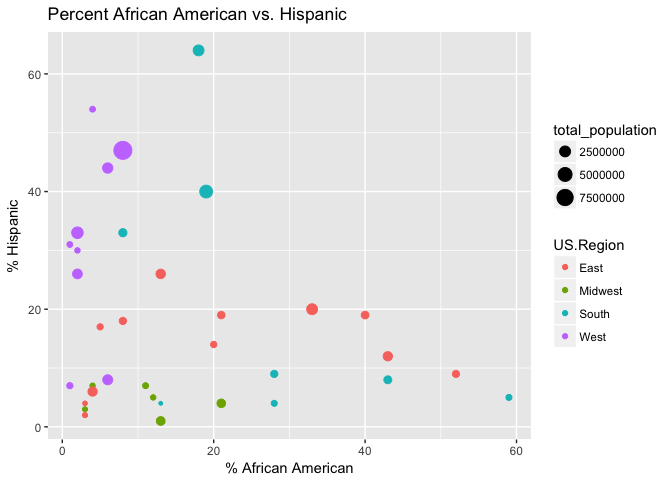
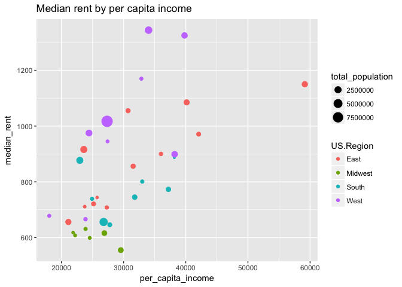

Data collection site demographics
================
Rick O. Gilmore
2017-03-20 05:11:23

Background
----------

This report provides preliminary analysis of the demographic characteristics of the sites under consideration to collect data for the PLAY project. This report focuses on data at the county level. It uses the [`choroplethr`](https://cran.r-project.org/web/packages/choroplethr/index.html) package.

Generate data file(s)
---------------------

Load county names, and add county FIPS from `choroplethr` package's `county.regions` dataset. With this, I can extract demographic data using the `get_county_demographics()` function.

``` r
counties <- read.csv(paste0(csv.dir, "city-state-county.csv"), stringsAsFactors = FALSE)

# convert counties so can pull FIPS codes
counties$County <- tolower(counties$County)

# Load county data from choroplethr
# Could also use acs package to get updated info.
data("county.regions")

counties <- left_join(counties, county.regions,
                         by = c("County" = "county.name",
                                "State" = "state.abb"))

demo <- get_county_demographics(endyear=2010, span=5)

county.demo <- left_join(counties, demo)
str(county.demo)
```

    ## 'data.frame':    35 obs. of  16 variables:
    ##  $ City                 : chr  "Riverside" "Palo Alto" "Fullerton" "Davis" ...
    ##  $ State                : chr  "CA" "CA" "CA" "CA" ...
    ##  $ County               : chr  "riverside" "santa clara" "orange" "yolo" ...
    ##  $ US.Region            : chr  "West" "West" "West" "West" ...
    ##  $ region               : num  6065 6085 6059 6113 6087 ...
    ##  $ county.fips.character: chr  "06065" "06085" "06059" "06113" ...
    ##  $ state.name           : chr  "california" "california" "california" "california" ...
    ##  $ state.fips.character : chr  "06" "06" "06" "06" ...
    ##  $ total_population     : num  2109464 1739396 2965525 196418 256901 ...
    ##  $ percent_white        : num  41 37 46 51 61 33 28 33 16 42 ...
    ##  $ percent_black        : num  6 2 2 2 1 4 8 52 18 43 ...
    ##  $ percent_asian        : num  6 31 17 13 4 7 14 3 2 5 ...
    ##  $ percent_hispanic     : num  44 26 33 30 31 54 47 9 64 8 ...
    ##  $ per_capita_income    : num  24431 39804 34017 27420 32862 ...
    ##  $ median_rent          : num  975 1325 1344 945 1170 ...
    ##  $ median_age           : num  33.4 35.8 35.7 30.1 36.6 29.3 34.3 34.3 37.7 34 ...

``` r
# Function to add initial capital
Init.cap <- function(s) {
  stopifnot(is.character(s))
  paste0(toupper(str_sub(s,1,1)), str_sub(s,2,str_length(s)))
}

# Recapitalize county
county.demo$County <- Init.cap(county.demo$County)
```

Tabular summary
---------------

``` r
county.demo %>%
  arrange(US.Region, State, City, County) %>%
  select(US.Region, City, State, County, total_population, percent_white,
         percent_black, percent_asian, percent_hispanic) %>%
  knitr::kable()
```

| US.Region | City            | State | County               |  total\_population|  percent\_white|  percent\_black|  percent\_asian|  percent\_hispanic|
|:----------|:----------------|:------|:---------------------|------------------:|---------------:|---------------:|---------------:|------------------:|
| East      | Washington      | DC    | District of columbia |             584400|              33|              52|               3|                  9|
| East      | Boston          | MA    | Suffolk              |             704460|              49|              21|               8|                 19|
| East      | Cambridge       | MA    | Middlesex            |            1479491|              78|               4|               9|                  6|
| East      | Newark          | NJ    | Essex                |             780872|              34|              40|               5|                 19|
| East      | Princeton       | NJ    | Mercer               |             364445|              56|              20|               9|                 14|
| East      | Brooklyn        | NY    | Kings                |            2466782|              36|              33|              10|                 20|
| East      | Ithaca          | NY    | Tompkins             |             100612|              81|               3|               9|                  4|
| East      | New York        | NY    | New york             |            1583345|              48|              13|              11|                 26|
| East      | Lehigh          | PA    | Lehigh               |             343946|              74|               5|               3|                 17|
| East      | Philadelphia    | PA    | Philadelphia         |            1504950|              37|              43|               6|                 12|
| East      | University Park | PA    | Centre               |             151411|              88|               3|               5|                  2|
| East      | Providence      | RI    | Providence           |             628413|              68|               8|               4|                 18|
| Midwest   | Champaign       | IL    | Champaign            |             197867|              72|              12|               9|                  5|
| Midwest   | Bloomington     | IN    | Monroe               |             134442|              87|               3|               5|                  3|
| Midwest   | W. Lafayette    | IN    | Tippecanoe           |             168635|              81|               4|               6|                  7|
| Midwest   | East Lansing    | MI    | Ingham               |             281365|              73|              11|               5|                  7|
| Midwest   | Columbus        | OH    | Franklin             |            1141117|              68|              21|               4|                  4|
| Midwest   | Pittsburgh      | PA    | Allegheny            |            1223066|              81|              13|               3|                  1|
| South     | Miami           | FL    | Miami-dade           |            2445374|              16|              18|               2|                 64|
| South     | Atlanta         | GA    | Fulton               |             886982|              42|              43|               5|                  8|
| South     | New Orleans     | LA    | Orleans              |             295285|              31|              59|               3|                  5|
| South     | Nashville       | TN    | Davidson             |             612884|              59|              28|               3|                  9|
| South     | Austin          | TX    | Travis               |             979712|              51|               8|               6|                 33|
| South     | Houston         | TX    | Harris               |            3950999|              34|              19|               6|                 40|
| South     | Richmond        | VA    | Henrico              |             300053|              59|              28|               6|                  4|
| South     | Williamsburg    | VA    | James city           |              64386|              78|              13|               2|                  4|
| West      | Davis           | CA    | Yolo                 |             196418|              51|               2|              13|                 30|
| West      | Fullerton       | CA    | Orange               |            2965525|              46|               2|              17|                 33|
| West      | Long Beach      | CA    | Los angeles          |            9758256|              28|               8|              14|                 47|
| West      | Merced          | CA    | Merced               |             250699|              33|               4|               7|                 54|
| West      | Palo Alto       | CA    | Santa clara          |            1739396|              37|               2|              31|                 26|
| West      | Riverside       | CA    | Riverside            |            2109464|              41|               6|               6|                 44|
| West      | Santa Cruz      | CA    | Santa cruz           |             256901|              61|               1|               4|                 31|
| West      | Eugene          | OR    | Lane                 |             347156|              85|               1|               2|                  7|
| West      | Seattle         | WA    | King                 |            1879189|              66|               6|              14|                  8|

Population by region
--------------------

``` r
county.demo %>%
  ggplot() +
  aes(x = US.Region, y = total_population) +
  geom_violin() +
  geom_point() +
  ggtitle("Population by region")
```



Race & ethnicity
----------------

``` r
county.demo %>%
  ggplot() +
  aes(x = US.Region, y = percent_black) +
  geom_violin() +
  geom_point() +
  ggtitle("African American population by region") +
  ylab("% African American")
```



``` r
county.demo %>%
  ggplot() +
  aes(x = US.Region, y = percent_hispanic) +
  geom_violin() +
  geom_point() +
  ggtitle("Hispanic population by region") +
  ylab("% Hispanic")
```



``` r
county.demo %>%
  ggplot() +
  aes(x = US.Region, y = percent_asian) +
  geom_violin() +
  geom_point() +
  ggtitle("Asian population by region") +
  ylab("% Asian")
```



``` r
county.demo %>%
  ggplot() +
  aes(x = percent_black, y = percent_hispanic, 
      color = US.Region,
      size = total_population) +
  geom_point() +
  ggtitle("Percent African American vs. Hispanic") +
  xlab("% African American") +
  ylab("% Hispanic")
```



Economic indicators
-------------------

``` r
county.demo %>%
  ggplot() +
  aes(x = per_capita_income, y = median_rent,
      color = US.Region,
      size = total_population) +
  geom_point() +
  ggtitle("Median rent by per capita income")
```



Resources
---------

### R Session

``` r
sessionInfo()
```

    ## R version 3.3.2 (2016-10-31)
    ## Platform: x86_64-apple-darwin13.4.0 (64-bit)
    ## Running under: OS X El Capitan 10.11.6
    ## 
    ## locale:
    ## [1] en_US.UTF-8/en_US.UTF-8/en_US.UTF-8/C/en_US.UTF-8/en_US.UTF-8
    ## 
    ## attached base packages:
    ## [1] stats     graphics  grDevices utils     datasets  methods   base     
    ## 
    ## other attached packages:
    ## [1] choroplethrMaps_1.0.1 choroplethr_3.5.3     acs_2.0              
    ## [4] XML_3.98-1.5          plyr_1.8.4            stringr_1.2.0        
    ## [7] dplyr_0.5.0           ggplot2_2.2.1        
    ## 
    ## loaded via a namespace (and not attached):
    ##  [1] reshape2_1.4.2      splines_3.3.2       lattice_0.20-34    
    ##  [4] WDI_2.4             colorspace_1.3-2    htmltools_0.3.5    
    ##  [7] yaml_2.1.14         base64enc_0.1-3     survival_2.40-1    
    ## [10] foreign_0.8-67      DBI_0.6             sp_1.2-4           
    ## [13] RColorBrewer_1.1-2  jpeg_0.1-8          munsell_0.4.3      
    ## [16] gtable_0.2.0        htmlwidgets_0.8     RgoogleMaps_1.4.1  
    ## [19] mapproj_1.2-4       evaluate_0.10       labeling_0.3       
    ## [22] latticeExtra_0.6-28 knitr_1.15.1        highr_0.6          
    ## [25] htmlTable_1.9       proto_1.0.0         Rcpp_0.12.9        
    ## [28] acepack_1.4.1       geosphere_1.5-5     scales_0.4.1       
    ## [31] backports_1.0.5     checkmate_1.8.2     Hmisc_4.0-2        
    ## [34] gridExtra_2.2.1     rjson_0.2.15        png_0.1-7          
    ## [37] digest_0.6.12       stringi_1.1.2       grid_3.3.2         
    ## [40] rprojroot_1.2       tools_3.3.2         bitops_1.0-6       
    ## [43] maps_3.1.1          magrittr_1.5        lazyeval_0.2.0     
    ## [46] RCurl_1.95-4.8      tibble_1.2          Formula_1.2-1      
    ## [49] pacman_0.4.1        cluster_2.0.5       Matrix_1.2-8       
    ## [52] data.table_1.10.4   assertthat_0.1      rmarkdown_1.3      
    ## [55] R6_2.2.0            rpart_4.1-10        ggmap_2.7          
    ## [58] nnet_7.3-12
