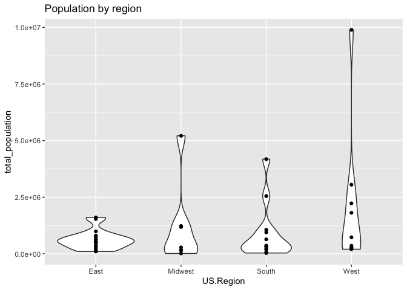
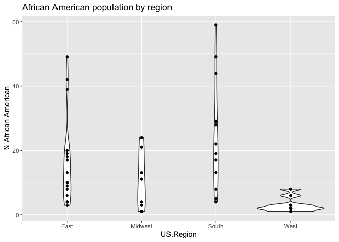
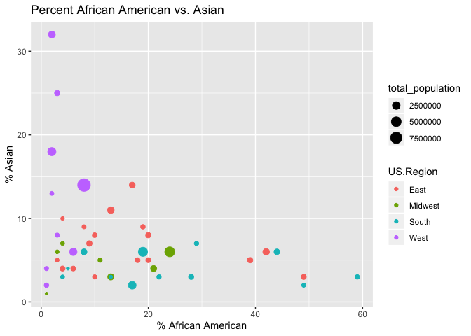

Data collection site demographics
================
Rick O. Gilmore
2017-05-16 10:30:01

Background
----------

This report provides preliminary analysis of the demographic characteristics of the sites under consideration to collect data for the PLAY project. This report focuses on data at the county level. It uses the [`choroplethr`](https://cran.r-project.org/web/packages/choroplethr/index.html) package.

Generate data file(s)
---------------------

Load county names, and add county FIPS from `choroplethr` package's `county.regions` dataset. With this, I can extract demographic data using the `get_county_demographics()` function.

``` r
counties <- read.csv(paste0(csv.dir, "city-state-county.csv"), stringsAsFactors = FALSE)

# Load county data from choroplethr
# Could also use acs package to get updated info.
data("county.regions")

counties <- left_join(counties, county.regions)

demo <- get_county_demographics(endyear=2013, span=5)

county.demo <- left_join(counties, demo)

# Recapitalize county
county.demo$County <- unlist(lapply(county.demo$County, Cap.all))
```

Tabular summary
---------------

``` r
# Select collecting sites only
county.demo %>%
  filter(Collecting == "Collecting") ->
  county.demo

county.demo %>%
  arrange(US.Region, Site.code, State, City, County) %>%
  select(US.Region, Site.code, City, State, County, total_population, percent_white,
         percent_black, percent_asian, percent_hispanic) %>%
  knitr::kable()
```

| US.Region | Site.code | City            | State | County               |  total\_population|  percent\_white|  percent\_black|  percent\_asian|  percent\_hispanic|
|:----------|:----------|:----------------|:------|:---------------------|------------------:|---------------:|---------------:|---------------:|------------------:|
| East      | BU        | Boston          | MA    | Suffolk              |             735701|              48|              20|               8|                 20|
| East      | CHOP      | Camden          | NJ    | Camden               |             513512|              60|              18|               5|                 15|
| East      | CHOP      | Woodbury        | NJ    | Gloucester           |             289098|              80|              10|               3|                  5|
| East      | CHOP      | Doylestown      | PA    | Bucks                |             625977|              86|               4|               4|                  4|
| East      | CHOP      | Media           | PA    | Delaware             |             559771|              70|              20|               5|                  3|
| East      | CHOP      | Norristown      | PA    | Montgomery           |             804621|              78|               9|               7|                  4|
| East      | CHOP      | Philadelphia    | PA    | Philadelphia         |            1536704|              37|              42|               6|                 13|
| East      | CHOP      | West Chester    | PA    | Chester              |             503075|              82|               6|               4|                  7|
| East      | COR       | Ithaca          | NY    | Tompkins             |             102270|              79|               4|              10|                  4|
| East      | CUNYSI    | Staten Island   | NY    | Richmond             |             470223|              64|              10|               8|                 17|
| East      | GTN       | Washington      | DC    | District Of columbia |             619371|              35|              49|               3|                 10|
| East      | GTN       | Bethesda        | MD    | Montgomery           |             989474|              48|              17|              14|                 17|
| East      | GTN       | Arlington       | VA    | Arlington            |             214861|              64|               8|               9|                 15|
| East      | NYU       | New York        | NY    | New York             |            1605272|              48|              13|              11|                 26|
| East      | PRIN      | Princeton       | NJ    | Mercer               |             368094|              54|              19|               9|                 16|
| East      | PSU       | University Park | PA    | Centre               |             154460|              88|               3|               5|                  3|
| East      | RUTG      | Newark          | NJ    | Essex                |             785853|              33|              39|               5|                 21|
| East      | VCU       | Chesterfield    | VA    | Chesterfield         |             320430|              65|              22|               3|                  7|
| East      | VCU       | Richmond        | VA    | Richmond             |             207878|              39|              49|               2|                  6|
| Midwest   | IU        | Bloomington     | IN    | Monroe               |             139634|              86|               3|               6|                  3|
| Midwest   | MSU       | East Lansing    | MI    | Clinton              |              14017|              96|               1|               1|                  1|
| Midwest   | MSU       | East Lansing    | MI    | Ingham               |             281531|              72|              11|               5|                  7|
| Midwest   | OSU       | Columbus        | OH    | Franklin             |            1181824|              67|              21|               4|                  5|
| Midwest   | PITT      | Pittsburgh      | PA    | Allegheny            |            1226933|              80|              13|               3|                  2|
| Midwest   | PUR       | W. Lafayette    | IN    | Tippecanoe           |             175628|              80|               4|               7|                  8|
| South     | EMRY      | Atlanta         | GA    | Fulton               |             948554|              41|              44|               6|                  8|
| South     | HOU       | Houston         | TX    | Harris               |            4182285|              33|              19|               6|                 41|
| South     | TUL       | New Orleans     | LA    | Orleans              |             357013|              31|              59|               3|                  5|
| South     | UMIA      | Miami           | FL    | Miami-Dade           |            2549075|              16|              17|               2|                 65|
| South     | UT        | Austin          | TX    | Travis               |            1063248|              50|               8|               6|                 34|
| South     | VBLT      | Nashville       | TN    | Davidson             |             638395|              57|              28|               3|                 10|
| South     | VCU       | Richmond        | VA    | Henrico              |             311314|              56|              29|               7|                  5|
| South     | WM        | Williamsburg    | VA    | James City           |              68171|              77|              13|               3|                  5|
| West      | CSF       | Fullerton       | CA    | Orange               |            3051771|              43|               2|              18|                 34|
| West      | CSL       | Long Beach      | CA    | Los Angeles          |            9893481|              28|               8|              14|                 48|
| West      | STAN      | Palo Alto       | CA    | San Mateo            |             729543|              42|               3|              25|                 25|
| West      | STAN      | Palo Alto       | CA    | Santa Clara          |            1812208|              35|               2|              32|                 27|
| West      | UCD       | Davis           | CA    | Yolo                 |             202288|              49|               2|              13|                 31|
| West      | UCM       | Merced          | CA    | Merced               |             258707|              31|               3|               8|                 56|
| West      | UCR       | Riverside       | CA    | Riverside            |            2228528|              39|               6|               6|                 46|
| West      | UCSC      | Santa Cruz      | CA    | Santa Cruz           |             264808|              59|               1|               4|                 32|
| West      | UO        | Eugene          | OR    | Lane                 |             353382|              84|               1|               2|                  8|

Population by region
--------------------

``` r
county.demo %>%
  ggplot() +
  aes(x = US.Region, y = total_population) +
  geom_violin() +
  geom_point() +
  ggtitle("Population by region")
```



Race, ethnicity, & age
----------------------

``` r
county.demo %>%
  ggplot() +
  aes(x = US.Region, y = percent_black) +
  geom_violin() +
  geom_point() +
  ggtitle("African American population by region") +
  ylab("% African American")
```



``` r
county.demo %>%
  ggplot() +
  aes(x = US.Region, y = percent_hispanic) +
  geom_violin() +
  geom_point() +
  ggtitle("Hispanic population by region") +
  ylab("% Hispanic")
```


``` r
county.demo %>%
  ggplot() +
  aes(x = US.Region, y = percent_asian) +
  geom_violin() +
  geom_point() +
  ggtitle("Asian population by region") +
  ylab("% Asian")
```


``` r
county.demo %>%
  ggplot() +
  aes(x = percent_black, y = percent_hispanic, 
      color = US.Region,
      size = total_population) +
  geom_point() +
  ggtitle("Percent African American vs. Hispanic") +
  xlab("% African American") +
  ylab("% Hispanic")
```


``` r
county.demo %>%
  ggplot() +
  aes(x = percent_black, y = percent_asian, 
      color = US.Region,
      size = total_population) +
  geom_point() +
  ggtitle("Percent African American vs. Asian") +
  xlab("% African American") +
  ylab("% Asian")
```



``` r
county.demo %>%
  ggplot() +
  aes(x = percent_hispanic, y = percent_asian, 
      color = US.Region,
      size = total_population) +
  geom_point() +
  ggtitle("Percent Hispanic vs. Asian") +
  xlab("% Hispanic") +
  ylab("% Asian")
```


``` r
county.demo %>%
  ggplot() +
  aes(x = US.Region, y = median_age) +
  geom_violin() +
  geom_point() +
  ggtitle("Median age by region") +
  ylab("Age (yrs)")
```


Economic indicators
-------------------

``` r
county.demo %>%
  arrange(US.Region, Site.code, State, City, County) %>%
  select(US.Region, Site.code, City, State, County, total_population,
         per_capita_income, median_rent) %>%
  knitr::kable()
```

| US.Region | Site.code | City            | State | County               |  total\_population|  per\_capita\_income|  median\_rent|
|:----------|:----------|:----------------|:------|:---------------------|------------------:|--------------------:|-------------:|
| East      | BU        | Boston          | MA    | Suffolk              |             735701|                32835|          1135|
| East      | CHOP      | Camden          | NJ    | Camden               |             513512|                30592|           835|
| East      | CHOP      | Woodbury        | NJ    | Gloucester           |             289098|                32600|           893|
| East      | CHOP      | Doylestown      | PA    | Bucks                |             625977|                37466|           964|
| East      | CHOP      | Media           | PA    | Delaware             |             559771|                33179|           826|
| East      | CHOP      | Norristown      | PA    | Montgomery           |             804621|                41472|           976|
| East      | CHOP      | Philadelphia    | PA    | Philadelphia         |            1536704|                22279|           721|
| East      | CHOP      | West Chester    | PA    | Chester              |             503075|                42210|          1004|
| East      | COR       | Ithaca          | NY    | Tompkins             |             102270|                27418|           857|
| East      | CUNYSI    | Staten Island   | NY    | Richmond             |             470223|                31823|          1017|
| East      | GTN       | Washington      | DC    | District Of columbia |             619371|                45290|          1154|
| East      | GTN       | Bethesda        | MD    | Montgomery           |             989474|                49038|          1423|
| East      | GTN       | Arlington       | VA    | Arlington            |             214861|                62018|          1659|
| East      | NYU       | New York        | NY    | New York             |            1605272|                62498|          1342|
| East      | PRIN      | Princeton       | NJ    | Mercer               |             368094|                37465|           959|
| East      | PSU       | University Park | PA    | Centre               |             154460|                25545|           795|
| East      | RUTG      | Newark          | NJ    | Essex                |             785853|                32181|           917|
| East      | VCU       | Chesterfield    | VA    | Chesterfield         |             320430|                32572|           918|
| East      | VCU       | Richmond        | VA    | Richmond             |             207878|                27184|           719|
| Midwest   | IU        | Bloomington     | IN    | Monroe               |             139634|                23032|           679|
| Midwest   | MSU       | East Lansing    | MI    | Clinton              |              14017|                21492|           492|
| Midwest   | MSU       | East Lansing    | MI    | Ingham               |             281531|                24754|           664|
| Midwest   | OSU       | Columbus        | OH    | Franklin             |            1181824|                28283|           658|
| Midwest   | PITT      | Pittsburgh      | PA    | Allegheny            |            1226933|                31593|           603|
| Midwest   | PUR       | W. Lafayette    | IN    | Tippecanoe           |             175628|                23691|           650|
| South     | EMRY      | Atlanta         | GA    | Fulton               |             948554|                36757|           802|
| South     | HOU       | Houston         | TX    | Harris               |            4182285|                27899|           720|
| South     | TUL       | New Orleans     | LA    | Orleans              |             357013|                26500|           765|
| South     | UMIA      | Miami           | FL    | Miami-Dade           |            2549075|                23174|           949|
| South     | UT        | Austin          | TX    | Travis               |            1063248|                33206|           832|
| South     | VBLT      | Nashville       | TN    | Davidson             |             638395|                28467|           691|
| South     | VCU       | Richmond        | VA    | Henrico              |             311314|                33115|           858|
| South     | WM        | Williamsburg    | VA    | James City           |              68171|                39133|          1048|
| West      | CSF       | Fullerton       | CA    | Orange               |            3051771|                34057|          1413|
| West      | CSL       | Long Beach      | CA    | Los Angeles          |            9893481|                27749|          1110|
| West      | STAN      | Palo Alto       | CA    | San Mateo            |             729543|                45732|          1509|
| West      | STAN      | Palo Alto       | CA    | Santa Clara          |            1812208|                41513|          1473|
| West      | UCD       | Davis           | CA    | Yolo                 |             202288|                27730|           991|
| West      | UCM       | Merced          | CA    | Merced               |             258707|                18177|           725|
| West      | UCR       | Riverside       | CA    | Riverside            |            2228528|                23591|          1015|
| West      | UCSC      | Santa Cruz      | CA    | Santa Cruz           |             264808|                32295|          1282|
| West      | UO        | Eugene          | OR    | Lane                 |             353382|                24224|           720|

``` r
county.demo %>%
  ggplot() +
  aes(x = per_capita_income, y = median_rent,
      color = US.Region,
      size = total_population) +
  geom_point() +
  ggtitle("Median rent by per capita income")
```


Further exploration of the ACS
------------------------------

The `acs` package manual can be found here: <https://cran.r-project.org/web/packages/acs/acs.pdf>. A useful guide to the ACS can be found here: <https://www.census.gov/content/dam/Census/library/publications/2008/acs/ACSGeneralHandbook.pdf>. And, an especially useful guide by the `acs` package author can be found here: <http://dusp.mit.edu/sites/dusp.mit.edu/files/attachments/publications/working_with_acs_R_v_2.0.pdf>

### Generate geography for sites

As a first attempt, create vectors of numeric state FIPS and county FIPS codes.

``` r
state.fips <- as.numeric(county.demo$state.fips.character)
county.fips <- as.numeric(substr(county.demo$county.fips.character,3,5))
play.geo <- geo.make(state = state.fips, county = county.fips)
```

This works, but after some further exploration, I think it may be better to generate site-specific geographies.

``` r
Make.county.geo <- function(i, df) {
  geo.make(state = as.numeric(df$state.fips.character[i]),
              county =
             as.numeric(substr(county.demo$county.fips.character[i],4, 6)))
}

cty <- 1
# Generate name for county-level geography
geo.name <- paste0(county.demo$Site.code[cty], "_", county.demo$county.name[cty], "_", county.demo$State[cty])

# Create geography and assign to generated name
assign(geo.name, Make.county.geo(cty, county.demo))
```

### Education data

``` r
ed.attain <- acs.lookup(table.name="Educational Attainment for the Population 25 Years and Over", endyear=2015)

# Variables 1:25 seem to contain the relevant info

play.ed <- acs.fetch(geography = play.geo, endyear = 2015, variable = ed.attain[1:25],
                     col.names = c("Total",
                                   "None",
                                   "<K",
                                   "K",
                                   "1st",
                                   "2nd",
                                   "3rd",
                                   "4th",
                                   "5th",
                                   "6th",
                                   "7th",
                                   "8th",
                                   "9th",
                                   "10th",
                                   "11th",
                                   "12th",
                                   "HS",
                                   "GED",
                                   "Coll <1yr",
                                   "Coll >1yr",
                                   "AA",
                                   "BA",
                                   "MA",
                                   "Prof",
                                   "Ph.D"))
# These numbers seem weird to me

play.ed
```

    ## ACS DATA: 
    ##  2011 -- 2015 ;
    ##   Estimates w/90% confidence intervals;
    ##   for different intervals, see confint()
    ##                                            Total           None           
    ## Suffolk County, Massachusetts              511404 +/- 109  11692 +/- 941  
    ## Philadelphia County, Pennsylvania          1024009 +/- 91  20729 +/- 1163 
    ## Delaware County, Pennsylvania              376325 +/- 51   3580 +/- 449   
    ## Montgomery County, Pennsylvania            568085 +/- 62   3135 +/- 371   
    ## Chester County, Pennsylvania               342356 +/- 85   2108 +/- 329   
    ## Bucks County, Pennsylvania                 440969 +/- 50   2497 +/- 351   
    ## Camden County, New Jersey                  346315 +/- 83   5328 +/- 510   
    ## Gloucester County, New Jersey              196038 +/- 60   1508 +/- 275   
    ## Tompkins County, New York                  59323 +/- 87    355 +/- 170    
    ## Orange County, California                  2077783 +/- 0   45546 +/- 1677 
    ## Los Angeles County, California             6653174 +/- 0   217614 +/- 3684
    ## Richmond County, New York                  322287 +/- 68   3957 +/- 459   
    ## Fulton County, Georgia                     650445 +/- 138  4982 +/- 713   
    ## District of Columbia, District of Columbia 453952 +/- 79   5198 +/- 486   
    ## Arlington County, Virginia                 168459 +/- 177  2943 +/- 769   
    ## Montgomery County, Maryland                698595 +/- 127  10356 +/- 774  
    ## Harris County, Texas                       2734398 +/- 197 65998 +/- 2240 
    ## Monroe County, Indiana                     79416 +/- 101   468 +/- 167    
    ## Ingham County, Michigan                    169257 +/- 92   1794 +/- 259   
    ## Crawford County, Michigan                  10349 +/- 41    90 +/- 38      
    ## New York County, New York                  1229036 +/- 183 24558 +/- 1426 
    ## Franklin County, Ohio                      797167 +/- 172  10007 +/- 738  
    ## Allegheny County, Pennsylvania             877398 +/- 60   6841 +/- 603   
    ## Mercer County, New Jersey                  247262 +/- 54   2977 +/- 420   
    ## Centre County, Pennsylvania                91495 +/- 141   606 +/- 166    
    ## Tippecanoe County, Indiana                 99327 +/- 47    674 +/- 171    
    ## Essex County, New Jersey                   524610 +/- 123  8836 +/- 727   
    ## Santa Clara County, California             1268629 +/- 0   27534 +/- 1216 
    ## San Mateo County, California               530221 +/- 71   10082 +/- 748  
    ## Orleans Parish, Louisiana                  258654 +/- 73   2843 +/- 344   
    ## Yolo County, California                    120693 +/- 152  2583 +/- 372   
    ## Merced County, California                  152405 +/- 148  7100 +/- 605   
    ## Riverside County, California               1441999 +/- 0   33537 +/- 1679 
    ## Santa Cruz County, California              173902 +/- 188  2740 +/- 335   
    ## Miami-Dade County, Florida                 1838746 +/- 138 42055 +/- 1793 
    ## Lane County, Oregon                        241134 +/- 112  1765 +/- 488   
    ## Travis County, Texas                       742369 +/- 43   10343 +/- 918  
    ## Davidson County, Tennessee                 446174 +/- 72   6759 +/- 734   
    ## Henrico County, Virginia                   217423 +/- 89   2579 +/- 424   
    ## Chesterfield County, Virginia              216740 +/- 104  2171 +/- 342   
    ## Richmond city, Virginia                    143240 +/- 64   2610 +/- 411   
    ## James City County, Virginia                50954 +/- 233   411 +/- 205    
    ##                                            <K           K           
    ## Suffolk County, Massachusetts              38 +/- 42    264 +/- 136 
    ## Philadelphia County, Pennsylvania          361 +/- 154  279 +/- 180 
    ## Delaware County, Pennsylvania              90 +/- 73    34 +/- 41   
    ## Montgomery County, Pennsylvania            67 +/- 38    61 +/- 41   
    ## Chester County, Pennsylvania               98 +/- 91    2 +/- 5     
    ## Bucks County, Pennsylvania                 33 +/- 30    21 +/- 22   
    ## Camden County, New Jersey                  52 +/- 41    79 +/- 53   
    ## Gloucester County, New Jersey              0 +/- 28     2 +/- 4     
    ## Tompkins County, New York                  0 +/- 27     0 +/- 27    
    ## Orange County, California                  559 +/- 189  691 +/- 194 
    ## Los Angeles County, California             1813 +/- 260 2783 +/- 304
    ## Richmond County, New York                  116 +/- 97   103 +/- 64  
    ## Fulton County, Georgia                     135 +/- 101  97 +/- 90   
    ## District of Columbia, District of Columbia 39 +/- 42    80 +/- 77   
    ## Arlington County, Virginia                 0 +/- 28     38 +/- 37   
    ## Montgomery County, Maryland                159 +/- 78   323 +/- 150 
    ## Harris County, Texas                       642 +/- 194  740 +/- 224 
    ## Monroe County, Indiana                     0 +/- 27     0 +/- 27    
    ## Ingham County, Michigan                    7 +/- 13     39 +/- 27   
    ## Crawford County, Michigan                  0 +/- 16     0 +/- 16    
    ## New York County, New York                  143 +/- 87   389 +/- 211 
    ## Franklin County, Ohio                      179 +/- 109  107 +/- 57  
    ## Allegheny County, Pennsylvania             41 +/- 30    111 +/- 59  
    ## Mercer County, New Jersey                  11 +/- 13    42 +/- 32   
    ## Centre County, Pennsylvania                0 +/- 23     10 +/- 18   
    ## Tippecanoe County, Indiana                 16 +/- 23    0 +/- 27    
    ## Essex County, New Jersey                   140 +/- 68   177 +/- 96  
    ## Santa Clara County, California             348 +/- 111  462 +/- 124 
    ## San Mateo County, California               35 +/- 38    106 +/- 61  
    ## Orleans Parish, Louisiana                  30 +/- 34    15 +/- 17   
    ## Yolo County, California                    33 +/- 42    75 +/- 90   
    ## Merced County, California                  42 +/- 43    128 +/- 80  
    ## Riverside County, California               222 +/- 96   477 +/- 154 
    ## Santa Cruz County, California              36 +/- 50    62 +/- 74   
    ## Miami-Dade County, Florida                 955 +/- 224  408 +/- 178 
    ## Lane County, Oregon                        22 +/- 27    61 +/- 68   
    ## Travis County, Texas                       220 +/- 170  146 +/- 82  
    ## Davidson County, Tennessee                 39 +/- 28    78 +/- 59   
    ## Henrico County, Virginia                   9 +/- 14     18 +/- 30   
    ## Chesterfield County, Virginia              0 +/- 28     23 +/- 26   
    ## Richmond city, Virginia                    16 +/- 19    51 +/- 37   
    ## James City County, Virginia                0 +/- 28     0 +/- 28    
    ##                                            1st           2nd           
    ## Suffolk County, Massachusetts              647 +/- 199   2110 +/- 361  
    ## Philadelphia County, Pennsylvania          592 +/- 157   1117 +/- 265  
    ## Delaware County, Pennsylvania              103 +/- 76    201 +/- 106   
    ## Montgomery County, Pennsylvania            118 +/- 89    130 +/- 118   
    ## Chester County, Pennsylvania               104 +/- 66    241 +/- 121   
    ## Bucks County, Pennsylvania                 35 +/- 32     91 +/- 58     
    ## Camden County, New Jersey                  286 +/- 116   491 +/- 166   
    ## Gloucester County, New Jersey              28 +/- 32     59 +/- 49     
    ## Tompkins County, New York                  0 +/- 27      0 +/- 27      
    ## Orange County, California                  2035 +/- 308  6615 +/- 659  
    ## Los Angeles County, California             14391 +/- 802 33566 +/- 1282
    ## Richmond County, New York                  103 +/- 66    287 +/- 110   
    ## Fulton County, Georgia                     240 +/- 130   180 +/- 109   
    ## District of Columbia, District of Columbia 229 +/- 121   528 +/- 193   
    ## Arlington County, Virginia                 7 +/- 9       151 +/- 109   
    ## Montgomery County, Maryland                553 +/- 184   1492 +/- 376  
    ## Harris County, Texas                       4102 +/- 556  12003 +/- 1033
    ## Monroe County, Indiana                     0 +/- 27      0 +/- 27      
    ## Ingham County, Michigan                    8 +/- 13      66 +/- 55     
    ## Crawford County, Michigan                  0 +/- 16      0 +/- 16      
    ## New York County, New York                  1260 +/- 368  2713 +/- 447  
    ## Franklin County, Ohio                      178 +/- 100   506 +/- 259   
    ## Allegheny County, Pennsylvania             182 +/- 108   250 +/- 126   
    ## Mercer County, New Jersey                  35 +/- 35     304 +/- 113   
    ## Centre County, Pennsylvania                0 +/- 23      19 +/- 30     
    ## Tippecanoe County, Indiana                 0 +/- 27      142 +/- 79    
    ## Essex County, New Jersey                   367 +/- 183   1016 +/- 248  
    ## Santa Clara County, California             874 +/- 183   2592 +/- 383  
    ## San Mateo County, California               528 +/- 199   1471 +/- 348  
    ## Orleans Parish, Louisiana                  200 +/- 88    253 +/- 120   
    ## Yolo County, California                    180 +/- 105   450 +/- 221   
    ## Merced County, California                  511 +/- 148   1412 +/- 286  
    ## Riverside County, California               2080 +/- 376  4741 +/- 583  
    ## Santa Cruz County, California              270 +/- 117   913 +/- 259   
    ## Miami-Dade County, Florida                 2688 +/- 456  5756 +/- 647  
    ## Lane County, Oregon                        137 +/- 112   88 +/- 62     
    ## Travis County, Texas                       758 +/- 296   1514 +/- 325  
    ## Davidson County, Tennessee                 143 +/- 90    358 +/- 131   
    ## Henrico County, Virginia                   5 +/- 6       115 +/- 91    
    ## Chesterfield County, Virginia              125 +/- 68    174 +/- 97    
    ## Richmond city, Virginia                    47 +/- 46     270 +/- 113   
    ## James City County, Virginia                0 +/- 28      0 +/- 28      
    ##                                            3rd            4th           
    ## Suffolk County, Massachusetts              3076 +/- 438   2977 +/- 480  
    ## Philadelphia County, Pennsylvania          2846 +/- 454   2914 +/- 426  
    ## Delaware County, Pennsylvania              429 +/- 168    335 +/- 117   
    ## Montgomery County, Pennsylvania            318 +/- 148    406 +/- 147   
    ## Chester County, Pennsylvania               876 +/- 230    201 +/- 92    
    ## Bucks County, Pennsylvania                 170 +/- 83     174 +/- 76    
    ## Camden County, New Jersey                  828 +/- 253    763 +/- 184   
    ## Gloucester County, New Jersey              126 +/- 67     88 +/- 62     
    ## Tompkins County, New York                  16 +/- 20      28 +/- 32     
    ## Orange County, California                  12890 +/- 893  8255 +/- 677  
    ## Los Angeles County, California             63872 +/- 1706 41752 +/- 1237
    ## Richmond County, New York                  381 +/- 120    521 +/- 162   
    ## Fulton County, Georgia                     1060 +/- 312   948 +/- 337   
    ## District of Columbia, District of Columbia 1353 +/- 339   1091 +/- 323  
    ## Arlington County, Virginia                 154 +/- 78     290 +/- 145   
    ## Montgomery County, Maryland                2046 +/- 330   1916 +/- 311  
    ## Harris County, Texas                       22328 +/- 1317 14626 +/- 994 
    ## Monroe County, Indiana                     25 +/- 23      33 +/- 40     
    ## Ingham County, Michigan                    172 +/- 75     153 +/- 73    
    ## Crawford County, Michigan                  22 +/- 17      10 +/- 11     
    ## New York County, New York                  5230 +/- 680   4329 +/- 537  
    ## Franklin County, Ohio                      862 +/- 325    836 +/- 254   
    ## Allegheny County, Pennsylvania             327 +/- 119    425 +/- 157   
    ## Mercer County, New Jersey                  588 +/- 267    284 +/- 114   
    ## Centre County, Pennsylvania                8 +/- 10       17 +/- 19     
    ## Tippecanoe County, Indiana                 142 +/- 91     89 +/- 73     
    ## Essex County, New Jersey                   2327 +/- 392   3394 +/- 432  
    ## Santa Clara County, California             5946 +/- 599   3484 +/- 371  
    ## San Mateo County, California               2545 +/- 397   1640 +/- 343  
    ## Orleans Parish, Louisiana                  589 +/- 196    711 +/- 199   
    ## Yolo County, California                    692 +/- 210    461 +/- 214   
    ## Merced County, California                  2833 +/- 427   1743 +/- 366  
    ## Riverside County, California               9799 +/- 830   6151 +/- 680  
    ## Santa Cruz County, California              1394 +/- 289   1140 +/- 282  
    ## Miami-Dade County, Florida                 10941 +/- 960  11055 +/- 805 
    ## Lane County, Oregon                        148 +/- 112    190 +/- 108   
    ## Travis County, Texas                       3384 +/- 536   2634 +/- 470  
    ## Davidson County, Tennessee                 1060 +/- 310   1065 +/- 250  
    ## Henrico County, Virginia                   497 +/- 219    175 +/- 104   
    ## Chesterfield County, Virginia              173 +/- 96     369 +/- 120   
    ## Richmond city, Virginia                    292 +/- 142    367 +/- 150   
    ## James City County, Virginia                8 +/- 17       40 +/- 48     
    ##                                            5th            6th            
    ## Suffolk County, Massachusetts              4839 +/- 631   6942 +/- 622   
    ## Philadelphia County, Pennsylvania          4083 +/- 521   8318 +/- 763   
    ## Delaware County, Pennsylvania              580 +/- 166    996 +/- 229    
    ## Montgomery County, Pennsylvania            756 +/- 169    1810 +/- 332   
    ## Chester County, Pennsylvania               523 +/- 161    2486 +/- 443   
    ## Bucks County, Pennsylvania                 362 +/- 117    1182 +/- 274   
    ## Camden County, New Jersey                  997 +/- 212    2288 +/- 424   
    ## Gloucester County, New Jersey              220 +/- 113    765 +/- 204    
    ## Tompkins County, New York                  31 +/- 30      108 +/- 94     
    ## Orange County, California                  10210 +/- 810  63775 +/- 1985 
    ## Los Angeles County, California             56909 +/- 1534 306175 +/- 3952
    ## Richmond County, New York                  1949 +/- 339   2546 +/- 469   
    ## Fulton County, Georgia                     1405 +/- 413   4974 +/- 781   
    ## District of Columbia, District of Columbia 1277 +/- 295   3062 +/- 500   
    ## Arlington County, Virginia                 429 +/- 174    1392 +/- 432   
    ## Montgomery County, Maryland                2256 +/- 378   8066 +/- 812   
    ## Harris County, Texas                       21524 +/- 1301 98162 +/- 2933 
    ## Monroe County, Indiana                     6 +/- 11       277 +/- 144    
    ## Ingham County, Michigan                    183 +/- 86     456 +/- 155    
    ## Crawford County, Michigan                  0 +/- 16       25 +/- 23      
    ## New York County, New York                  7850 +/- 795   15738 +/- 1126 
    ## Franklin County, Ohio                      1346 +/- 323   3052 +/- 471   
    ## Allegheny County, Pennsylvania             706 +/- 195    1543 +/- 293   
    ## Mercer County, New Jersey                  862 +/- 227    4419 +/- 601   
    ## Centre County, Pennsylvania                27 +/- 25      73 +/- 55      
    ## Tippecanoe County, Indiana                 156 +/- 102    740 +/- 208    
    ## Essex County, New Jersey                   2576 +/- 376   9568 +/- 826   
    ## Santa Clara County, California             6492 +/- 608   24410 +/- 1208 
    ## San Mateo County, California               2277 +/- 386   9874 +/- 957   
    ## Orleans Parish, Louisiana                  513 +/- 142    1795 +/- 280   
    ## Yolo County, California                    519 +/- 156    2800 +/- 518   
    ## Merced County, California                  2043 +/- 398   10922 +/- 986  
    ## Riverside County, California               7608 +/- 669   46584 +/- 1904 
    ## Santa Cruz County, California              1315 +/- 372   5308 +/- 703   
    ## Miami-Dade County, Florida                 14146 +/- 1076 61782 +/- 2378 
    ## Lane County, Oregon                        451 +/- 165    1278 +/- 232   
    ## Travis County, Texas                       3543 +/- 527   16384 +/- 1080 
    ## Davidson County, Tennessee                 1053 +/- 242   3838 +/- 564   
    ## Henrico County, Virginia                   475 +/- 198    1412 +/- 349   
    ## Chesterfield County, Virginia              351 +/- 170    1174 +/- 273   
    ## Richmond city, Virginia                    502 +/- 139    2064 +/- 516   
    ## James City County, Virginia                1 +/- 3        203 +/- 144    
    ##                                            7th            8th           
    ## Suffolk County, Massachusetts              4245 +/- 452   7562 +/- 695  
    ## Philadelphia County, Pennsylvania          5618 +/- 602   15118 +/- 926 
    ## Delaware County, Pennsylvania              774 +/- 173    2237 +/- 342  
    ## Montgomery County, Pennsylvania            926 +/- 189    4158 +/- 392  
    ## Chester County, Pennsylvania               780 +/- 157    3490 +/- 457  
    ## Bucks County, Pennsylvania                 824 +/- 195    2464 +/- 358  
    ## Camden County, New Jersey                  1246 +/- 298   4275 +/- 518  
    ## Gloucester County, New Jersey              500 +/- 176    1514 +/- 303  
    ## Tompkins County, New York                  35 +/- 35      242 +/- 102   
    ## Orange County, California                  11291 +/- 904  20611 +/- 1308
    ## Los Angeles County, California             47508 +/- 1585 99483 +/- 2034
    ## Richmond County, New York                  1328 +/- 331   3736 +/- 468  
    ## Fulton County, Georgia                     2331 +/- 497   4750 +/- 698  
    ## District of Columbia, District of Columbia 2439 +/- 345   4080 +/- 497  
    ## Arlington County, Virginia                 505 +/- 184    826 +/- 247   
    ## Montgomery County, Maryland                2618 +/- 385   4886 +/- 577  
    ## Harris County, Texas                       25793 +/- 1516 39767 +/- 1769
    ## Monroe County, Indiana                     193 +/- 87     860 +/- 195   
    ## Ingham County, Michigan                    443 +/- 143    1243 +/- 198  
    ## Crawford County, Michigan                  14 +/- 14      108 +/- 41    
    ## New York County, New York                  7638 +/- 810   18922 +/- 1413
    ## Franklin County, Ohio                      1902 +/- 398   6584 +/- 616  
    ## Allegheny County, Pennsylvania             1192 +/- 253   4850 +/- 400  
    ## Mercer County, New Jersey                  1142 +/- 290   3316 +/- 504  
    ## Centre County, Pennsylvania                145 +/- 74     1201 +/- 231  
    ## Tippecanoe County, Indiana                 254 +/- 119    1143 +/- 297  
    ## Essex County, New Jersey                   2948 +/- 387   8742 +/- 744  
    ## Santa Clara County, California             4837 +/- 513   13015 +/- 889 
    ## San Mateo County, California               1345 +/- 255   4881 +/- 639  
    ## Orleans Parish, Louisiana                  1448 +/- 230   3517 +/- 384  
    ## Yolo County, California                    480 +/- 162    1063 +/- 246  
    ## Merced County, California                  1157 +/- 244   3166 +/- 427  
    ## Riverside County, California               7862 +/- 657   18836 +/- 1111
    ## Santa Cruz County, California              704 +/- 249    1810 +/- 356  
    ## Miami-Dade County, Florida                 16850 +/- 1147 28940 +/- 1309
    ## Lane County, Oregon                        549 +/- 190    2011 +/- 301  
    ## Travis County, Texas                       3361 +/- 548   6883 +/- 657  
    ## Davidson County, Tennessee                 2049 +/- 396   5420 +/- 551  
    ## Henrico County, Virginia                   874 +/- 202    1788 +/- 384  
    ## Chesterfield County, Virginia              834 +/- 237    1862 +/- 315  
    ## Richmond city, Virginia                    830 +/- 203    2081 +/- 301  
    ## James City County, Virginia                139 +/- 89     416 +/- 196   
    ##                                            9th             10th          
    ## Suffolk County, Massachusetts              7903 +/- 727    8577 +/- 631  
    ## Philadelphia County, Pennsylvania          18082 +/- 1189  34084 +/- 1560
    ## Delaware County, Pennsylvania              2794 +/- 307    5805 +/- 601  
    ## Montgomery County, Pennsylvania            3760 +/- 437    6475 +/- 504  
    ## Chester County, Pennsylvania               2979 +/- 379    4097 +/- 500  
    ## Bucks County, Pennsylvania                 2939 +/- 372    6016 +/- 467  
    ## Camden County, New Jersey                  4446 +/- 514    7364 +/- 516  
    ## Gloucester County, New Jersey              1942 +/- 296    3082 +/- 348  
    ## Tompkins County, New York                  317 +/- 104     707 +/- 173   
    ## Orange County, California                  41415 +/- 1899  23471 +/- 1215
    ## Los Angeles County, California             182843 +/- 3230 98237 +/- 2204
    ## Richmond County, New York                  3541 +/- 497    5010 +/- 576  
    ## Fulton County, Georgia                     6843 +/- 820    9291 +/- 861  
    ## District of Columbia, District of Columbia 5892 +/- 564    7202 +/- 593  
    ## Arlington County, Virginia                 714 +/- 252     862 +/- 231   
    ## Montgomery County, Maryland                6886 +/- 685    4838 +/- 517  
    ## Harris County, Texas                       84775 +/- 2984  50600 +/- 2141
    ## Monroe County, Indiana                     807 +/- 243     1349 +/- 250  
    ## Ingham County, Michigan                    1567 +/- 226    3047 +/- 380  
    ## Crawford County, Michigan                  159 +/- 58      218 +/- 56    
    ## New York County, New York                  15693 +/- 1144  18358 +/- 1364
    ## Franklin County, Ohio                      9618 +/- 744    14998 +/- 1070
    ## Allegheny County, Pennsylvania             5711 +/- 487    11005 +/- 610 
    ## Mercer County, New Jersey                  3428 +/- 451    4380 +/- 437  
    ## Centre County, Pennsylvania                644 +/- 150     1275 +/- 265  
    ## Tippecanoe County, Indiana                 1574 +/- 277    1866 +/- 424  
    ## Essex County, New Jersey                   8403 +/- 596    8996 +/- 613  
    ## Santa Clara County, California             16689 +/- 1220  13855 +/- 803 
    ## San Mateo County, California               5919 +/- 722    4044 +/- 414  
    ## Orleans Parish, Louisiana                  4406 +/- 433    6178 +/- 428  
    ## Yolo County, California                    1629 +/- 337    1877 +/- 340  
    ## Merced County, California                  5031 +/- 533    3436 +/- 481  
    ## Riverside County, California               38546 +/- 1841  26872 +/- 1172
    ## Santa Cruz County, California              2685 +/- 523    1813 +/- 442  
    ## Miami-Dade County, Florida                 43975 +/- 1744  30865 +/- 1524
    ## Lane County, Oregon                        2425 +/- 314    3635 +/- 545  
    ## Travis County, Texas                       13251 +/- 1058  8189 +/- 868  
    ## Davidson County, Tennessee                 7510 +/- 731    8381 +/- 747  
    ## Henrico County, Virginia                   2074 +/- 281    3166 +/- 495  
    ## Chesterfield County, Virginia              1917 +/- 300    3278 +/- 413  
    ## Richmond city, Virginia                    2349 +/- 342    4665 +/- 458  
    ## James City County, Virginia                392 +/- 144     777 +/- 279   
    ##                                            11th            12th           
    ## Suffolk County, Massachusetts              9333 +/- 735    10128 +/- 823  
    ## Philadelphia County, Pennsylvania          42995 +/- 1588  26994 +/- 1269 
    ## Delaware County, Pennsylvania              6361 +/- 641    5009 +/- 396   
    ## Montgomery County, Pennsylvania            7033 +/- 532    6344 +/- 520   
    ## Chester County, Pennsylvania               3876 +/- 457    3050 +/- 341   
    ## Bucks County, Pennsylvania                 6341 +/- 569    5700 +/- 529   
    ## Camden County, New Jersey                  7261 +/- 570    6111 +/- 507   
    ## Gloucester County, New Jersey              3632 +/- 392    2874 +/- 343   
    ## Tompkins County, New York                  854 +/- 257     726 +/- 180    
    ## Orange County, California                  28027 +/- 1461  51470 +/- 1751 
    ## Los Angeles County, California             146439 +/- 2916 198125 +/- 3330
    ## Richmond County, New York                  5801 +/- 553    7042 +/- 535   
    ## Fulton County, Georgia                     12809 +/- 926   8858 +/- 843   
    ## District of Columbia, District of Columbia 9883 +/- 658    6077 +/- 519   
    ## Arlington County, Virginia                 1134 +/- 342    1542 +/- 299   
    ## Montgomery County, Maryland                5387 +/- 694    9850 +/- 814   
    ## Harris County, Texas                       64071 +/- 2247  53036 +/- 1992 
    ## Monroe County, Indiana                     1108 +/- 220    945 +/- 199    
    ## Ingham County, Michigan                    2825 +/- 392    1880 +/- 335   
    ## Crawford County, Michigan                  441 +/- 89      209 +/- 57     
    ## New York County, New York                  20966 +/- 1242  20612 +/- 1371 
    ## Franklin County, Ohio                      18116 +/- 843   11460 +/- 745  
    ## Allegheny County, Pennsylvania             12966 +/- 684   10516 +/- 424  
    ## Mercer County, New Jersey                  5046 +/- 477    4226 +/- 354   
    ## Centre County, Pennsylvania                1111 +/- 227    1106 +/- 223   
    ## Tippecanoe County, Indiana                 1758 +/- 287    1100 +/- 201   
    ## Essex County, New Jersey                   14153 +/- 826   11277 +/- 760  
    ## Santa Clara County, California             15613 +/- 977   29078 +/- 1110 
    ## San Mateo County, California               5962 +/- 757    11179 +/- 887  
    ## Orleans Parish, Louisiana                  9558 +/- 586    6336 +/- 524   
    ## Yolo County, California                    2177 +/- 362    2489 +/- 376   
    ## Merced County, California                  4704 +/- 573    4731 +/- 501   
    ## Riverside County, California               39862 +/- 1678  43969 +/- 1700 
    ## Santa Cruz County, California              1823 +/- 443    3023 +/- 462   
    ## Miami-Dade County, Florida                 32847 +/- 1756  62847 +/- 2415 
    ## Lane County, Oregon                        4895 +/- 512    3787 +/- 379   
    ## Travis County, Texas                       9470 +/- 877    10241 +/- 965  
    ## Davidson County, Tennessee                 10897 +/- 872   8089 +/- 761   
    ## Henrico County, Virginia                   4228 +/- 524    2896 +/- 409   
    ## Chesterfield County, Virginia              3848 +/- 448    3288 +/- 424   
    ## Richmond city, Virginia                    5037 +/- 654    2906 +/- 345   
    ## James City County, Virginia                547 +/- 182     229 +/- 113    
    ##                                            HS              
    ## Suffolk County, Massachusetts              105321 +/- 2216 
    ## Philadelphia County, Pennsylvania          303482 +/- 3621 
    ## Delaware County, Pennsylvania              109267 +/- 2099 
    ## Montgomery County, Pennsylvania            128202 +/- 2214 
    ## Chester County, Pennsylvania               72590 +/- 1465  
    ## Bucks County, Pennsylvania                 124503 +/- 2001 
    ## Camden County, New Jersey                  97372 +/- 1821  
    ## Gloucester County, New Jersey              60930 +/- 1351  
    ## Tompkins County, New York                  9847 +/- 647    
    ## Orange County, California                  334018 +/- 4163 
    ## Los Angeles County, California             1264487 +/- 9529
    ## Richmond County, New York                  89721 +/- 2014  
    ## Fulton County, Georgia                     102621 +/- 2465 
    ## District of Columbia, District of Columbia 69678 +/- 1751  
    ## Arlington County, Virginia                 12479 +/- 839   
    ## Montgomery County, Maryland                89069 +/- 2284  
    ## Harris County, Texas                       543751 +/- 6847 
    ## Monroe County, Indiana                     15002 +/- 734   
    ## Ingham County, Michigan                    30648 +/- 1096  
    ## Crawford County, Michigan                  3095 +/- 242    
    ## New York County, New York                  129520 +/- 3350 
    ## Franklin County, Ohio                      176038 +/- 3051 
    ## Allegheny County, Pennsylvania             230930 +/- 2793 
    ## Mercer County, New Jersey                  56655 +/- 1468  
    ## Centre County, Pennsylvania                25796 +/- 856   
    ## Tippecanoe County, Indiana                 22618 +/- 947   
    ## Essex County, New Jersey                   136666 +/- 2791 
    ## Santa Clara County, California             170779 +/- 3292 
    ## San Mateo County, California               78944 +/- 2031  
    ## Orleans Parish, Louisiana                  52808 +/- 1589  
    ## Yolo County, California                    20759 +/- 1033  
    ## Merced County, California                  32165 +/- 1241  
    ## Riverside County, California               329859 +/- 4410 
    ## Santa Cruz County, California              23296 +/- 1004  
    ## Miami-Dade County, Florida                 476658 +/- 5144 
    ## Lane County, Oregon                        49042 +/- 1478  
    ## Travis County, Texas                       105688 +/- 2790 
    ## Davidson County, Tennessee                 90473 +/- 2087  
    ## Henrico County, Virginia                   42311 +/- 1431  
    ## Chesterfield County, Virginia              44710 +/- 1602  
    ## Richmond city, Virginia                    26086 +/- 1113  
    ## James City County, Virginia                9647 +/- 846    
    ##                                            GED             Coll <1yr      
    ## Suffolk County, Massachusetts              15409 +/- 866   16923 +/- 875  
    ## Philadelphia County, Pennsylvania          42862 +/- 1896  51217 +/- 1528 
    ## Delaware County, Pennsylvania              10340 +/- 656   21614 +/- 762  
    ## Montgomery County, Pennsylvania            12759 +/- 605   26694 +/- 986  
    ## Chester County, Pennsylvania               6768 +/- 564    14523 +/- 757  
    ## Bucks County, Pennsylvania                 10663 +/- 706   23681 +/- 936  
    ## Camden County, New Jersey                  11094 +/- 631   20438 +/- 901  
    ## Gloucester County, New Jersey              6377 +/- 475    13852 +/- 746  
    ## Tompkins County, New York                  1909 +/- 314    2523 +/- 335   
    ## Orange County, California                  33538 +/- 1341  111510 +/- 2338
    ## Los Angeles County, California             111160 +/- 2340 298573 +/- 5294
    ## Richmond County, New York                  13296 +/- 774   16010 +/- 856  
    ## Fulton County, Georgia                     14496 +/- 1154  24812 +/- 1242 
    ## District of Columbia, District of Columbia 12019 +/- 770   15459 +/- 774  
    ## Arlington County, Virginia                 1503 +/- 315    3295 +/- 389   
    ## Montgomery County, Maryland                8517 +/- 638    27083 +/- 1168 
    ## Harris County, Texas                       94088 +/- 2762  141079 +/- 3291
    ## Monroe County, Indiana                     2716 +/- 311    4382 +/- 453   
    ## Ingham County, Michigan                    5950 +/- 495    13014 +/- 662  
    ## Crawford County, Michigan                  568 +/- 119     947 +/- 146    
    ## New York County, New York                  25473 +/- 1370  29102 +/- 1305 
    ## Franklin County, Ohio                      24433 +/- 1241  46109 +/- 1495 
    ## Allegheny County, Pennsylvania             30769 +/- 1079  48543 +/- 1309 
    ## Mercer County, New Jersey                  6683 +/- 594    12680 +/- 649  
    ## Centre County, Pennsylvania                3129 +/- 367    4415 +/- 475   
    ## Tippecanoe County, Indiana                 3807 +/- 423    5455 +/- 545   
    ## Essex County, New Jersey                   14044 +/- 847   22984 +/- 1100 
    ## Santa Clara County, California             21635 +/- 1027  54310 +/- 1692 
    ## San Mateo County, California               8729 +/- 585    26076 +/- 1200 
    ## Orleans Parish, Louisiana                  7074 +/- 540    10557 +/- 521  
    ## Yolo County, California                    3014 +/- 435    7618 +/- 595   
    ## Merced County, California                  5705 +/- 500    10921 +/- 755  
    ## Riverside County, California               42455 +/- 1470  112056 +/- 2445
    ## Santa Cruz County, California              3637 +/- 415    9030 +/- 643   
    ## Miami-Dade County, Florida                 47251 +/- 1933  75840 +/- 2433 
    ## Lane County, Oregon                        11164 +/- 641   20788 +/- 873  
    ## Travis County, Texas                       21293 +/- 1176  34467 +/- 1645 
    ## Davidson County, Tennessee                 17023 +/- 899   22863 +/- 1103 
    ## Henrico County, Virginia                   7351 +/- 539    12472 +/- 837  
    ## Chesterfield County, Virginia              7516 +/- 645    13300 +/- 683  
    ## Richmond city, Virginia                    6901 +/- 544    6042 +/- 454   
    ## James City County, Virginia                1094 +/- 269    2983 +/- 391   
    ##                                            Coll >1yr       AA             
    ## Suffolk County, Massachusetts              55800 +/- 1686  24466 +/- 1210 
    ## Philadelphia County, Pennsylvania          127019 +/- 3134 55072 +/- 1945 
    ## Delaware County, Pennsylvania              42121 +/- 1293  27990 +/- 1091 
    ## Montgomery County, Pennsylvania            60213 +/- 1483  38430 +/- 1188 
    ## Chester County, Pennsylvania               34553 +/- 1188  20784 +/- 769  
    ## Bucks County, Pennsylvania                 54429 +/- 1486  33843 +/- 1199 
    ## Camden County, New Jersey                  46305 +/- 1578  24831 +/- 990  
    ## Gloucester County, New Jersey              24033 +/- 1013  17044 +/- 862  
    ## Tompkins County, New York                  5639 +/- 476    5834 +/- 513   
    ## Orange County, California                  325074 +/- 4032 162649 +/- 2556
    ## Los Angeles County, California             996513 +/- 7078 456997 +/- 4944
    ## Richmond County, New York                  42231 +/- 1541  25382 +/- 1049 
    ## Fulton County, Georgia                     91739 +/- 2279  37207 +/- 1675 
    ## District of Columbia, District of Columbia 46574 +/- 1618  14040 +/- 929  
    ## Arlington County, Virginia                 11309 +/- 853   6105 +/- 535   
    ## Montgomery County, Maryland                72849 +/- 2078  35203 +/- 1281 
    ## Harris County, Texas                       429736 +/- 5912 162181 +/- 3227
    ## Monroe County, Indiana                     10047 +/- 609   5479 +/- 567   
    ## Ingham County, Michigan                    27650 +/- 1005  15064 +/- 833  
    ## Crawford County, Michigan                  1614 +/- 175    1054 +/- 146   
    ## New York County, New York                  97892 +/- 2961  46092 +/- 1829 
    ## Franklin County, Ohio                      118039 +/- 2327 53326 +/- 1645 
    ## Allegheny County, Pennsylvania             97160 +/- 1872  82055 +/- 1615 
    ## Mercer County, New Jersey                  27522 +/- 1034  14634 +/- 901  
    ## Centre County, Pennsylvania                7064 +/- 526    6978 +/- 606   
    ## Tippecanoe County, Indiana                 14972 +/- 865   7897 +/- 509   
    ## Essex County, New Jersey                   67346 +/- 1662  29133 +/- 1214 
    ## Santa Clara County, California             157972 +/- 2526 90475 +/- 1981 
    ## San Mateo County, California               72902 +/- 2061  39781 +/- 1297 
    ## Orleans Parish, Louisiana                  47254 +/- 1330  11277 +/- 631  
    ## Yolo County, California                    16606 +/- 949   8149 +/- 602   
    ## Merced County, California                  23304 +/- 988   11417 +/- 701  
    ## Riverside County, California               258231 +/- 3697 110479 +/- 2451
    ## Santa Cruz County, California              30375 +/- 1488  16020 +/- 948  
    ## Miami-Dade County, Florida                 217658 +/- 4162 160206 +/- 3376
    ## Lane County, Oregon                        49512 +/- 1204  20705 +/- 965  
    ## Travis County, Texas                       107708 +/- 2638 41719 +/- 1546 
    ## Davidson County, Tennessee                 65740 +/- 1813  26961 +/- 1289 
    ## Henrico County, Virginia                   32452 +/- 1146  14077 +/- 842  
    ## Chesterfield County, Virginia              34495 +/- 1485  17163 +/- 923  
    ## Richmond city, Virginia                    20834 +/- 1011  7652 +/- 575   
    ## James City County, Virginia                6456 +/- 583    3648 +/- 386   
    ##                                            BA              
    ## Suffolk County, Massachusetts              118717 +/- 2039 
    ## Philadelphia County, Pennsylvania          152759 +/- 2536 
    ## Delaware County, Pennsylvania              79252 +/- 1609  
    ## Montgomery County, Pennsylvania            149379 +/- 2066 
    ## Chester County, Pennsylvania               100394 +/- 1888 
    ## Bucks County, Pennsylvania                 100389 +/- 1915 
    ## Camden County, New Jersey                  67059 +/- 1579  
    ## Gloucester County, New Jersey              38993 +/- 1185  
    ## Tompkins County, New York                  13169 +/- 668   
    ## Orange County, California                  506749 +/- 4449 
    ## Los Angeles County, California             1316803 +/- 6901
    ## Richmond County, New York                  59189 +/- 1517  
    ## Fulton County, Georgia                     195121 +/- 2999 
    ## District of Columbia, District of Columbia 105880 +/- 2305 
    ## Arlington County, Virginia                 58068 +/- 1451  
    ## Montgomery County, Maryland                185755 +/- 2565 
    ## Harris County, Texas                       517569 +/- 6124 
    ## Monroe County, Indiana                     17699 +/- 753   
    ## Ingham County, Michigan                    34613 +/- 1049  
    ## Crawford County, Michigan                  1151 +/- 172    
    ## New York County, New York                  388043 +/- 5777 
    ## Franklin County, Ohio                      189865 +/- 2725 
    ## Allegheny County, Pennsylvania             193560 +/- 2195 
    ## Mercer County, New Jersey                  51208 +/- 1339  
    ## Centre County, Pennsylvania                19843 +/- 753   
    ## Tippecanoe County, Indiana                 19647 +/- 945   
    ## Essex County, New Jersey                   103667 +/- 1957 
    ## Santa Clara County, California             330869 +/- 3473 
    ## San Mateo County, California               143912 +/- 2146 
    ## Orleans Parish, Louisiana                  51838 +/- 1210  
    ## Yolo County, California                    23810 +/- 996   
    ## Merced County, California                  13248 +/- 863   
    ## Riverside County, California               192721 +/- 3024 
    ## Santa Cruz County, California              40356 +/- 1294  
    ## Miami-Dade County, Florida                 314713 +/- 4331 
    ## Lane County, Oregon                        41452 +/- 1061  
    ## Travis County, Texas                       217271 +/- 3137 
    ## Davidson County, Tennessee                 105080 +/- 2222 
    ## Henrico County, Virginia                   54814 +/- 1384  
    ## Chesterfield County, Virginia              49730 +/- 1329  
    ## Richmond city, Virginia                    31303 +/- 1047  
    ## James City County, Virginia                13503 +/- 828   
    ##                                            MA              Prof           
    ## Suffolk County, Massachusetts              61449 +/- 1600  19520 +/- 855  
    ## Philadelphia County, Pennsylvania          70697 +/- 1867  23236 +/- 1064 
    ## Delaware County, Pennsylvania              38969 +/- 1327  10065 +/- 610  
    ## Montgomery County, Pennsylvania            79243 +/- 1568  22637 +/- 946  
    ## Chester County, Pennsylvania               48365 +/- 1284  10462 +/- 602  
    ## Bucks County, Pennsylvania                 47791 +/- 1303  9226 +/- 594   
    ## Camden County, New Jersey                  25850 +/- 997   7899 +/- 460   
    ## Gloucester County, New Jersey              13344 +/- 774   3091 +/- 360   
    ## Tompkins County, New York                  9938 +/- 597    1757 +/- 261   
    ## Orange County, California                  187565 +/- 3158 57152 +/- 2007 
    ## Los Angeles County, California             458481 +/- 5514 153427 +/- 2915
    ## Richmond County, New York                  30343 +/- 1239  6853 +/- 554   
    ## Fulton County, Georgia                     88876 +/- 2333  24466 +/- 1082 
    ## District of Columbia, District of Columbia 85795 +/- 1656  37856 +/- 1254 
    ## Arlington County, Virginia                 43246 +/- 1289  14380 +/- 989  
    ## Montgomery County, Maryland                132184 +/- 2317 44208 +/- 1172 
    ## Harris County, Texas                       196936 +/- 3630 54786 +/- 1895 
    ## Monroe County, Indiana                     12283 +/- 658   1783 +/- 241   
    ## Ingham County, Michigan                    17368 +/- 720   5052 +/- 361   
    ## Crawford County, Michigan                  407 +/- 104     164 +/- 64     
    ## New York County, New York                  217529 +/- 3767 88996 +/- 3229 
    ## Franklin County, Ohio                      75546 +/- 1844  19725 +/- 823  
    ## Allegheny County, Pennsylvania             94655 +/- 1646  24554 +/- 959  
    ## Mercer County, New Jersey                  31591 +/- 1185  6422 +/- 529   
    ## Centre County, Pennsylvania                11249 +/- 687   1633 +/- 250   
    ## Tippecanoe County, Indiana                 9710 +/- 557    1543 +/- 294   
    ## Essex County, New Jersey                   44799 +/- 1345  14928 +/- 710  
    ## Santa Clara County, California             199599 +/- 2855 34134 +/- 1356 
    ## San Mateo County, California               62487 +/- 1725  20113 +/- 875  
    ## Orleans Parish, Louisiana                  22831 +/- 831   11108 +/- 543  
    ## Yolo County, California                    12402 +/- 778   4405 +/- 389   
    ## Merced County, California                  4382 +/- 417    1382 +/- 242   
    ## Riverside County, California               76987 +/- 2319  19411 +/- 919  
    ## Santa Cruz County, California              17045 +/- 896   4860 +/- 515   
    ## Miami-Dade County, Florida                 110663 +/- 2627 48356 +/- 1769 
    ## Lane County, Oregon                        18240 +/- 767   4327 +/- 412   
    ## Travis County, Texas                       86065 +/- 1870  21356 +/- 882  
    ## Davidson County, Tennessee                 40405 +/- 1638  12050 +/- 733  
    ## Henrico County, Virginia                   24030 +/- 1115  6285 +/- 607   
    ## Chesterfield County, Virginia              22214 +/- 890   4454 +/- 454   
    ## Richmond city, Virginia                    13782 +/- 748   4263 +/- 329   
    ## James City County, Virginia                7291 +/- 589    1608 +/- 323   
    ##                                            Ph.D          
    ## Suffolk County, Massachusetts              13466 +/- 751 
    ## Philadelphia County, Pennsylvania          13535 +/- 806 
    ## Delaware County, Pennsylvania              7379 +/- 624  
    ## Montgomery County, Pennsylvania            15031 +/- 698 
    ## Chester County, Pennsylvania               9006 +/- 484  
    ## Bucks County, Pennsylvania                 7595 +/- 551  
    ## Camden County, New Jersey                  3652 +/- 401  
    ## Gloucester County, New Jersey              2034 +/- 353  
    ## Tompkins County, New York                  5288 +/- 379  
    ## Orange County, California                  32667 +/- 1309
    ## Los Angeles County, California             85223 +/- 1938
    ## Richmond County, New York                  2841 +/- 332  
    ## Fulton County, Georgia                     12204 +/- 855 
    ## District of Columbia, District of Columbia 18221 +/- 1009
    ## Arlington County, Virginia                 7087 +/- 544  
    ## Montgomery County, Maryland                42095 +/- 1411
    ## Harris County, Texas                       36105 +/- 1589
    ## Monroe County, Indiana                     3954 +/- 491  
    ## Ingham County, Michigan                    6015 +/- 490  
    ## Crawford County, Michigan                  53 +/- 22     
    ## New York County, New York                  41990 +/- 1916
    ## Franklin County, Ohio                      14335 +/- 886 
    ## Allegheny County, Pennsylvania             18506 +/- 945 
    ## Mercer County, New Jersey                  8807 +/- 641  
    ## Centre County, Pennsylvania                5146 +/- 459  
    ## Tippecanoe County, Indiana                 4024 +/- 405  
    ## Essex County, New Jersey                   8123 +/- 598  
    ## Santa Clara County, California             43627 +/- 1341
    ## San Mateo County, California               15389 +/- 810 
    ## Orleans Parish, Louisiana                  5515 +/- 393  
    ## Yolo County, California                    6422 +/- 520  
    ## Merced County, California                  922 +/- 225   
    ## Riverside County, California               12654 +/- 795 
    ## Santa Cruz County, California              4247 +/- 432  
    ## Miami-Dade County, Florida                 21291 +/- 1215
    ## Lane County, Oregon                        4462 +/- 439  
    ## Travis County, Texas                       16481 +/- 915 
    ## Davidson County, Tennessee                 8840 +/- 584  
    ## Henrico County, Virginia                   3320 +/- 374  
    ## Chesterfield County, Virginia              3571 +/- 398  
    ## Richmond city, Virginia                    2290 +/- 283  
    ## James City County, Virginia                1561 +/- 262

Next steps
----------

1.  ~~We should confirm that our target sites collect data from the counties listed, and that the county-wide demographics are plausible~~.
2.  ~~We should also see if there are *other* counties target sites collect from and consider asking them to estimate the proportion of their recruiting that comes from county A vs. county B~~. It would be fun to have a Shiny app to collect this.
3.  We should explore the `acs` package to grab additional demographic data, especially the indicators used in the draft grant proposal. The `choroplethr` package used in the above had demographic variables similar, but not identical to the ones we have used in the proposal.

Resources
---------

### R Session

This document was prepared in RStudio 1.0.136. Session information follows.

``` r
sessionInfo()
```

    ## R version 3.4.0 (2017-04-21)
    ## Platform: x86_64-apple-darwin15.6.0 (64-bit)
    ## Running under: macOS Sierra 10.12.4
    ## 
    ## Matrix products: default
    ## BLAS: /Library/Frameworks/R.framework/Versions/3.4/Resources/lib/libRblas.0.dylib
    ## LAPACK: /Library/Frameworks/R.framework/Versions/3.4/Resources/lib/libRlapack.dylib
    ## 
    ## locale:
    ## [1] en_US.UTF-8/en_US.UTF-8/en_US.UTF-8/C/en_US.UTF-8/en_US.UTF-8
    ## 
    ## attached base packages:
    ## [1] stats     graphics  grDevices utils     datasets  methods   base     
    ## 
    ## other attached packages:
    ## [1] choroplethrMaps_1.0.1 choroplethr_3.6.1     acs_2.0              
    ## [4] XML_3.98-1.7          plyr_1.8.4            stringr_1.2.0        
    ## [7] dplyr_0.5.0           ggplot2_2.2.1        
    ## 
    ## loaded via a namespace (and not attached):
    ##  [1] Rcpp_0.12.10        lattice_0.20-35     png_0.1-7          
    ##  [4] assertthat_0.2.0    rprojroot_1.2       digest_0.6.12      
    ##  [7] R6_2.2.0            backports_1.0.5     acepack_1.4.1      
    ## [10] evaluate_0.10       highr_0.6           httr_1.2.1         
    ## [13] RgoogleMaps_1.4.1   lazyeval_0.2.0      uuid_0.1-2         
    ## [16] data.table_1.10.4   geosphere_1.5-5     rpart_4.1-11       
    ## [19] Matrix_1.2-9        checkmate_1.8.2     rmarkdown_1.5      
    ## [22] labeling_0.3        proto_1.0.0         splines_3.4.0      
    ## [25] rgdal_1.2-7         udunits2_0.13       foreign_0.8-67     
    ## [28] htmlwidgets_0.8     RCurl_1.95-4.8      munsell_0.4.3      
    ## [31] compiler_3.4.0      tigris_0.5          base64enc_0.1-3    
    ## [34] rgeos_0.3-23        htmltools_0.3.6     nnet_7.3-12        
    ## [37] tibble_1.3.0        gridExtra_2.2.1     htmlTable_1.9      
    ## [40] Hmisc_4.0-3         sf_0.4-1            bitops_1.0-6       
    ## [43] rappdirs_0.3.1      grid_3.4.0          gtable_0.2.0       
    ## [46] DBI_0.6-1           WDI_2.4             pacman_0.4.5       
    ## [49] magrittr_1.5        units_0.4-4         scales_0.4.1       
    ## [52] stringi_1.1.5       mapproj_1.2-4       reshape2_1.4.2     
    ## [55] sp_1.2-4            latticeExtra_0.6-28 Formula_1.2-1      
    ## [58] rjson_0.2.15        RColorBrewer_1.1-2  tools_3.4.0        
    ## [61] ggmap_2.6.1         maps_3.1.1          jpeg_0.1-8         
    ## [64] survival_2.41-3     yaml_2.1.14         colorspace_1.3-2   
    ## [67] cluster_2.0.6       maptools_0.9-2      knitr_1.15.20
