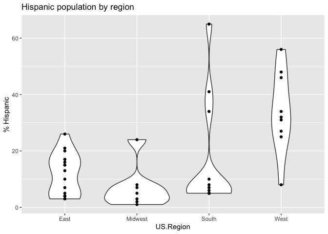
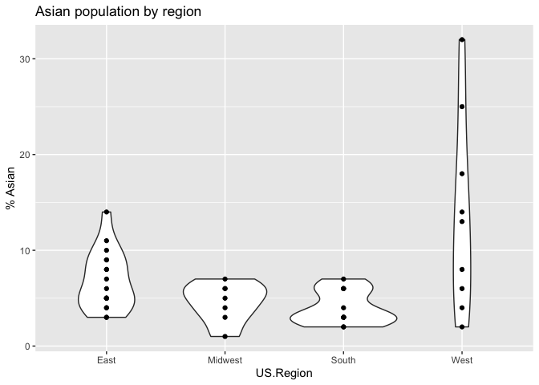
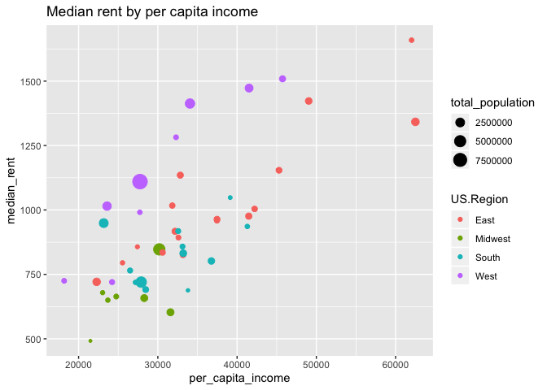

Data collection site demographics
================
Rick O. Gilmore
2017-05-10 09:15:14

Background
----------

This report provides preliminary analysis of the demographic characteristics of the sites under consideration to collect data for the PLAY project. This report focuses on data at the county level. It uses the [`choroplethr`](https://cran.r-project.org/web/packages/choroplethr/index.html) package.

Generate data file(s)
---------------------

Load county names, and add county FIPS from `choroplethr` package's `county.regions` dataset. With this, I can extract demographic data using the `get_county_demographics()` function.

``` r
counties <- read.csv(paste0(csv.dir, "city-state-county.csv"), stringsAsFactors = FALSE)

# convert counties so can pull FIPS codes
counties$County <- tolower(counties$County)

# Load county data from choroplethr
# Could also use acs package to get updated info.
data("county.regions")

counties <- left_join(counties, county.regions,
                         by = c("County" = "county.name",
                                "State" = "state.abb"))

demo <- get_county_demographics(endyear=2013, span=5)

county.demo <- left_join(counties, demo)
#str(county.demo)

# Recapitalize county
county.demo$County <- unlist(lapply(county.demo$County, Cap.all))
```

Tabular summary
---------------

``` r
# Select collecting sites only
county.demo %>%
  filter(Collecting == "Collecting") ->
  county.demo

county.demo %>%
  arrange(US.Region, State, City, County) %>%
  select(US.Region, City, State, County, total_population, percent_white,
         percent_black, percent_asian, percent_hispanic) %>%
  knitr::kable()
```

| US.Region | City            | State | County               |  total\_population|  percent\_white|  percent\_black|  percent\_asian|  percent\_hispanic|
|:----------|:----------------|:------|:---------------------|------------------:|---------------:|---------------:|---------------:|------------------:|
| East      | Washington      | DC    | District Of columbia |             619371|              35|              49|               3|                 10|
| East      | Boston          | MA    | Suffolk              |             735701|              48|              20|               8|                 20|
| East      | Bethesda        | MD    | Montgomery           |             989474|              48|              17|              14|                 17|
| East      | Camden          | NJ    | Camden               |             513512|              60|              18|               5|                 15|
| East      | Newark          | NJ    | Essex                |             785853|              33|              39|               5|                 21|
| East      | Princeton       | NJ    | Mercer               |             368094|              54|              19|               9|                 16|
| East      | Woodbury        | NJ    | Gloucester           |             289098|              80|              10|               3|                  5|
| East      | Ithaca          | NY    | Tompkins             |             102270|              79|               4|              10|                  4|
| East      | New York        | NY    | New York             |            1605272|              48|              13|              11|                 26|
| East      | Staten Island   | NY    | Richmond             |             470223|              64|              10|               8|                 17|
| East      | Doylestown      | PA    | Bucks                |             625977|              86|               4|               4|                  4|
| East      | Media           | PA    | Delaware             |             559771|              70|              20|               5|                  3|
| East      | Norristown      | PA    | Montgomery           |             804621|              78|               9|               7|                  4|
| East      | Philadelphia    | PA    | Philadelphia         |            1536704|              37|              42|               6|                 13|
| East      | University Park | PA    | Centre               |             154460|              88|               3|               5|                  3|
| East      | West Chester    | PA    | Chester              |             503075|              82|               6|               4|                  7|
| East      | Arlington       | VA    | Arlington            |             214861|              64|               8|               9|                 15|
| Midwest   | Bloomington     | IN    | Monroe               |             139634|              86|               3|               6|                  3|
| Midwest   | W. Lafayette    | IN    | Tippecanoe           |             175628|              80|               4|               7|                  8|
| Midwest   | East Lansing    | MI    | Ingham               |             281531|              72|              11|               5|                  7|
| Midwest   | Columbus        | OH    | Franklin             |            1181824|              67|              21|               4|                  5|
| Midwest   | Pittsburgh      | PA    | Allegheny            |            1226933|              80|              13|               3|                  2|
| South     | Miami           | FL    | Miami-Dade           |            2549075|              16|              17|               2|                 65|
| South     | Atlanta         | GA    | Fulton               |             948554|              41|              44|               6|                  8|
| South     | New Orleans     | LA    | Orleans              |             357013|              31|              59|               3|                  5|
| South     | Nashville       | TN    | Davidson             |             638395|              57|              28|               3|                 10|
| South     | Austin          | TX    | Travis               |            1063248|              50|               8|               6|                 34|
| South     | Houston         | TX    | Harris               |            4182285|              33|              19|               6|                 41|
| South     | Richmond        | VA    | Henrico              |             311314|              56|              29|               7|                  5|
| South     | Williamsburg    | VA    | James City           |              68171|              77|              13|               3|                  5|
| West      | Davis           | CA    | Yolo                 |             202288|              49|               2|              13|                 31|
| West      | Fullerton       | CA    | Orange               |            3051771|              43|               2|              18|                 34|
| West      | Long Beach      | CA    | Los Angeles          |            9893481|              28|               8|              14|                 48|
| West      | Merced          | CA    | Merced               |             258707|              31|               3|               8|                 56|
| West      | Palo Alto       | CA    | San Mateo            |             729543|              42|               3|              25|                 25|
| West      | Palo Alto       | CA    | Santa Clara          |            1812208|              35|               2|              32|                 27|
| West      | Riverside       | CA    | Riverside            |            2228528|              39|               6|               6|                 46|
| West      | Santa Cruz      | CA    | Santa Cruz           |             264808|              59|               1|               4|                 32|
| West      | Eugene          | OR    | Lane                 |             353382|              84|               1|               2|                  8|

Population by region
--------------------

``` r
county.demo %>%
  ggplot() +
  aes(x = US.Region, y = total_population) +
  geom_violin() +
  geom_point() +
  ggtitle("Population by region")
```


Race, ethnicity, & age
----------------------

``` r
county.demo %>%
  ggplot() +
  aes(x = US.Region, y = percent_black) +
  geom_violin() +
  geom_point() +
  ggtitle("African American population by region") +
  ylab("% African American")
```


``` r
county.demo %>%
  ggplot() +
  aes(x = US.Region, y = percent_hispanic) +
  geom_violin() +
  geom_point() +
  ggtitle("Hispanic population by region") +
  ylab("% Hispanic")
```



``` r
county.demo %>%
  ggplot() +
  aes(x = US.Region, y = percent_asian) +
  geom_violin() +
  geom_point() +
  ggtitle("Asian population by region") +
  ylab("% Asian")
```



``` r
county.demo %>%
  ggplot() +
  aes(x = percent_black, y = percent_hispanic, 
      color = US.Region,
      size = total_population) +
  geom_point() +
  ggtitle("Percent African American vs. Hispanic") +
  xlab("% African American") +
  ylab("% Hispanic")
```


``` r
county.demo %>%
  ggplot() +
  aes(x = percent_black, y = percent_asian, 
      color = US.Region,
      size = total_population) +
  geom_point() +
  ggtitle("Percent African American vs. Asian") +
  xlab("% African American") +
  ylab("% Asian")
```


``` r
county.demo %>%
  ggplot() +
  aes(x = percent_hispanic, y = percent_asian, 
      color = US.Region,
      size = total_population) +
  geom_point() +
  ggtitle("Percent Hispanic vs. Asian") +
  xlab("% Hispanic") +
  ylab("% Asian")
```


``` r
county.demo %>%
  ggplot() +
  aes(x = US.Region, y = median_age) +
  geom_violin() +
  geom_point() +
  ggtitle("Median age by region") +
  ylab("Age (yrs)")
```


Economic indicators
-------------------

``` r
county.demo %>%
  arrange(US.Region, State, City, County) %>%
  select(US.Region, City, State, County, total_population,
         per_capita_income, median_rent) %>%
  knitr::kable()
```

| US.Region | City            | State | County               |  total\_population|  per\_capita\_income|  median\_rent|
|:----------|:----------------|:------|:---------------------|------------------:|--------------------:|-------------:|
| East      | Washington      | DC    | District Of columbia |             619371|                45290|          1154|
| East      | Boston          | MA    | Suffolk              |             735701|                32835|          1135|
| East      | Bethesda        | MD    | Montgomery           |             989474|                49038|          1423|
| East      | Camden          | NJ    | Camden               |             513512|                30592|           835|
| East      | Newark          | NJ    | Essex                |             785853|                32181|           917|
| East      | Princeton       | NJ    | Mercer               |             368094|                37465|           959|
| East      | Woodbury        | NJ    | Gloucester           |             289098|                32600|           893|
| East      | Ithaca          | NY    | Tompkins             |             102270|                27418|           857|
| East      | New York        | NY    | New York             |            1605272|                62498|          1342|
| East      | Staten Island   | NY    | Richmond             |             470223|                31823|          1017|
| East      | Doylestown      | PA    | Bucks                |             625977|                37466|           964|
| East      | Media           | PA    | Delaware             |             559771|                33179|           826|
| East      | Norristown      | PA    | Montgomery           |             804621|                41472|           976|
| East      | Philadelphia    | PA    | Philadelphia         |            1536704|                22279|           721|
| East      | University Park | PA    | Centre               |             154460|                25545|           795|
| East      | West Chester    | PA    | Chester              |             503075|                42210|          1004|
| East      | Arlington       | VA    | Arlington            |             214861|                62018|          1659|
| Midwest   | Bloomington     | IN    | Monroe               |             139634|                23032|           679|
| Midwest   | W. Lafayette    | IN    | Tippecanoe           |             175628|                23691|           650|
| Midwest   | East Lansing    | MI    | Ingham               |             281531|                24754|           664|
| Midwest   | Columbus        | OH    | Franklin             |            1181824|                28283|           658|
| Midwest   | Pittsburgh      | PA    | Allegheny            |            1226933|                31593|           603|
| South     | Miami           | FL    | Miami-Dade           |            2549075|                23174|           949|
| South     | Atlanta         | GA    | Fulton               |             948554|                36757|           802|
| South     | New Orleans     | LA    | Orleans              |             357013|                26500|           765|
| South     | Nashville       | TN    | Davidson             |             638395|                28467|           691|
| South     | Austin          | TX    | Travis               |            1063248|                33206|           832|
| South     | Houston         | TX    | Harris               |            4182285|                27899|           720|
| South     | Richmond        | VA    | Henrico              |             311314|                33115|           858|
| South     | Williamsburg    | VA    | James City           |              68171|                39133|          1048|
| West      | Davis           | CA    | Yolo                 |             202288|                27730|           991|
| West      | Fullerton       | CA    | Orange               |            3051771|                34057|          1413|
| West      | Long Beach      | CA    | Los Angeles          |            9893481|                27749|          1110|
| West      | Merced          | CA    | Merced               |             258707|                18177|           725|
| West      | Palo Alto       | CA    | San Mateo            |             729543|                45732|          1509|
| West      | Palo Alto       | CA    | Santa Clara          |            1812208|                41513|          1473|
| West      | Riverside       | CA    | Riverside            |            2228528|                23591|          1015|
| West      | Santa Cruz      | CA    | Santa Cruz           |             264808|                32295|          1282|
| West      | Eugene          | OR    | Lane                 |             353382|                24224|           720|

``` r
county.demo %>%
  ggplot() +
  aes(x = per_capita_income, y = median_rent,
      color = US.Region,
      size = total_population) +
  geom_point() +
  ggtitle("Median rent by per capita income")
```



Further exploration of the ACS
------------------------------

The `acs` package manual can be found here: <https://cran.r-project.org/web/packages/acs/acs.pdf>. A useful guide to the ACS can be found here: <https://www.census.gov/content/dam/Census/library/publications/2008/acs/ACSGeneralHandbook.pdf>. And, an especially useful guide by the `acs` package author can be found here: <http://dusp.mit.edu/sites/dusp.mit.edu/files/attachments/publications/working_with_acs_R_v_2.0.pdf>

### Generate geography for sites

This is a work in progress.

<!-- ```{r generate-geo} -->
<!-- ``` -->
<!-- ```{r} -->
<!-- ed <- acs.lookup(table.name="Education", endyear=2011) -->
<!-- # Looks like 1:6 -->
<!-- acs.fetch(geography = centre, endyear = 2011, variable = ed[1:6], -->
<!--           col.names = c("Total", -->
<!--                         "<HS", -->
<!--                         "HS", -->
<!--                         "Some Coll", -->
<!--                         "BA", -->
<!--                         "Grad/Prof") -->
<!-- ) -->
<!-- ``` -->
Next steps
----------

1.  ~~We should confirm that our target sites collect data from the counties listed, and that the county-wide demographics are plausible~~.
2.  ~~We should also see if there are *other* counties target sites collect from and consider asking them to estimate the proportion of their recruiting that comes from county A vs. county B~~. It would be fun to have a Shiny app to collect this.
3.  We should explore the `acs` package to grab additional demographic data, especially the indicators used in the draft grant proposal. The `choroplethr` package used in the above had demographic variables similar, but not identical to the ones we have used in the proposal.

Resources
---------

### R Session

This document was prepared in RStudio 1.0.136. Session information follows.

``` r
sessionInfo()
```

    ## R version 3.4.0 (2017-04-21)
    ## Platform: x86_64-apple-darwin15.6.0 (64-bit)
    ## Running under: macOS Sierra 10.12.4
    ## 
    ## Matrix products: default
    ## BLAS: /Library/Frameworks/R.framework/Versions/3.4/Resources/lib/libRblas.0.dylib
    ## LAPACK: /Library/Frameworks/R.framework/Versions/3.4/Resources/lib/libRlapack.dylib
    ## 
    ## locale:
    ## [1] en_US.UTF-8/en_US.UTF-8/en_US.UTF-8/C/en_US.UTF-8/en_US.UTF-8
    ## 
    ## attached base packages:
    ## [1] stats     graphics  grDevices utils     datasets  methods   base     
    ## 
    ## other attached packages:
    ## [1] choroplethrMaps_1.0.1 choroplethr_3.6.1     acs_2.0              
    ## [4] XML_3.98-1.7          plyr_1.8.4            stringr_1.2.0        
    ## [7] dplyr_0.5.0           ggplot2_2.2.1        
    ## 
    ## loaded via a namespace (and not attached):
    ##  [1] Rcpp_0.12.10        lattice_0.20-35     png_0.1-7          
    ##  [4] assertthat_0.2.0    rprojroot_1.2       digest_0.6.12      
    ##  [7] R6_2.2.0            backports_1.0.5     acepack_1.4.1      
    ## [10] evaluate_0.10       highr_0.6           httr_1.2.1         
    ## [13] RgoogleMaps_1.4.1   lazyeval_0.2.0      uuid_0.1-2         
    ## [16] data.table_1.10.4   geosphere_1.5-5     rpart_4.1-11       
    ## [19] Matrix_1.2-9        checkmate_1.8.2     rmarkdown_1.5      
    ## [22] labeling_0.3        proto_1.0.0         splines_3.4.0      
    ## [25] rgdal_1.2-7         udunits2_0.13       foreign_0.8-67     
    ## [28] htmlwidgets_0.8     RCurl_1.95-4.8      munsell_0.4.3      
    ## [31] compiler_3.4.0      tigris_0.5          base64enc_0.1-3    
    ## [34] rgeos_0.3-23        htmltools_0.3.6     nnet_7.3-12        
    ## [37] tibble_1.3.0        gridExtra_2.2.1     htmlTable_1.9      
    ## [40] Hmisc_4.0-3         sf_0.4-1            bitops_1.0-6       
    ## [43] rappdirs_0.3.1      grid_3.4.0          gtable_0.2.0       
    ## [46] DBI_0.6-1           WDI_2.4             pacman_0.4.5       
    ## [49] magrittr_1.5        units_0.4-4         scales_0.4.1       
    ## [52] stringi_1.1.5       mapproj_1.2-4       reshape2_1.4.2     
    ## [55] sp_1.2-4            latticeExtra_0.6-28 Formula_1.2-1      
    ## [58] rjson_0.2.15        RColorBrewer_1.1-2  tools_3.4.0        
    ## [61] ggmap_2.6.1         maps_3.1.1          jpeg_0.1-8         
    ## [64] survival_2.41-3     yaml_2.1.14         colorspace_1.3-2   
    ## [67] cluster_2.0.6       maptools_0.9-2      knitr_1.15.1
